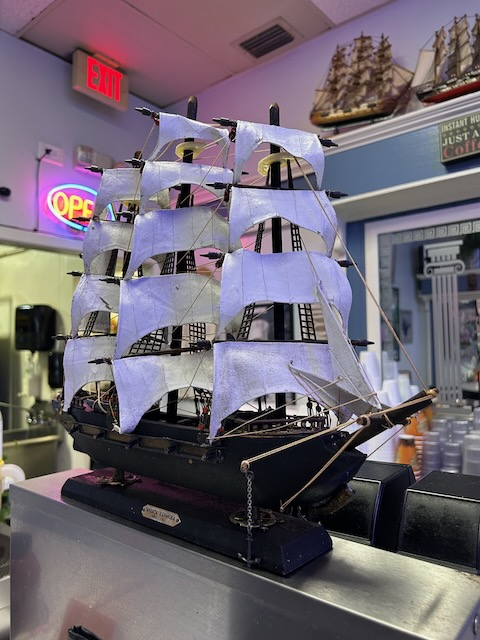
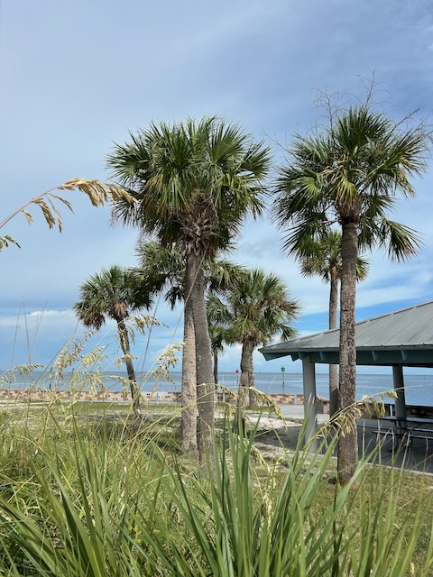
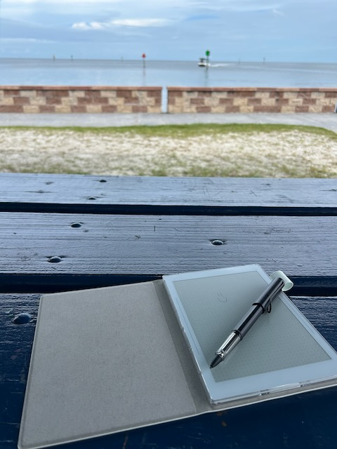
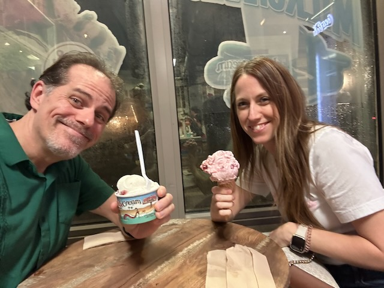

# I Love You Too

I entered vacation mode last night. Yay! This morning, I'm having breakfast at Sunnyside Up, a little breakfast and lunch diner in Hudson. I came here once in 2022 when I first moved here. Since I'm on vacation, I decided I'll eat out even on these days when I'm at home. I've been good about eating at home lately. I know the food I'll be eating this week won't be the best for me. But I don't do this often anymore. I'm enjoying a Belgium waffle, two eggs over easy, and a pair of sausage links. And of course, coffee. The waffle for Tyrese, the eggs for Cherie, and the sausage for my late maternal grandfather. For Tyrese, it's from the scene in Shrek when Donkey says *in the morning, I'm making waffles*...LOL She had made waffles for *the kids* yesterday...hehehe She works in a group home for children and teens. For Cherie, she always has eggs and I'll get to enjoy eggs with her this week for the first time...hehehe And for grandpa, he raised hogs for meat...LOL I remember seeing the hogs when I was very young. I remember them being huge! But I was little. So I really don't know how big they really were...hehehe

I'm grateful for this vacation. The number one reason is because I'll be spending three days of it with Cherie. We are doing the Dodgers/Angels game Wednesday. Thursday is our Disney Day at the parks. We will have matching outfits again this time. She will be Belle and I will be Gaston...LOL And Friday is Downtown Disney and the resorts. There will be a lot of new firsts on this trip. We shared in several firsts last year too. I love making new memories to look back on fondly. Especially with Cherie. She's my best friend with our fellowship, friendship, shared interests, and overall deep and strong connection. I'm grateful for all of 
her.

The rest of *my* part of the vacation is mostly unplanned. I'll rest, do some writing, and a lot of thinking as I pray through my thoughts. I have a lot juggling around up in my mind...hehehe Overall, I'm doing very well. I just have a lot on my mind about God, my purpose in His plan, my purpose in other people's lives, and about what I should be doing with my own life. I'm content and generally happy. And that is definitely enough. I don't really *want* more. I just have this anxious feeling that it's okay to have more. I'm trying to turn guilt into gratitude. I often turn pain into praise. So the guilt shouldn't stop me from accepting everything God has for my life. Of course, I also want to remain grounded. I don't want a positive attitude to become toxic. It's okay to struggle with things too. I don't want to resist the struggle and what blessings can come from it. There is always a purpose.

I'm at the Gulf now. I love listening to the birds chatter...LOL I love seeing the water. It's a pleasant morning to be here. I'm glad I came. I don't do this often enough anymore. It's time to change that. After all, it's one of the many reasons I moved here...hehehe To my surprise, I'm also enjoying the manmade sounds of machines in the background. And I'm enjoying seeing other people taking all of this in as well. Some of them are probably locals. Some might be on vacation visiting loved ones. Everyone living out there lives. I see people going out in their boats for a day out on the water. Staying inside so much seems to have made me forget how amazing this area actually is. It isn't perfect. But neither am I...LOL I'm seeing all of this with new *eyes* that are more open than they have ever been. I'm listening with new *ears* that are also more open than they have ever been. My heart has changed. I'm loving in new and exciting ways. Thank You, God, for transforming my heart.

I'm grateful for the gift of being able to write about these moments in the moment using my Supernote Nomad. It's small enough to take with me most places. When I can and want to, I can capture thoughts wherever I am. I've also added a dictation app to my phone and watch to capture fleeting thoughts before they get away, but when I can't stop to write. These tools have been helping me in so many ways. I don't take any of this for granted. I have  been blessed. It all helps me think, process my thoughts, and in a lot of ways, heal. As for being able to handwrite, I remember how I struggled with it last year when I first started writing by hand again. It had been quite awhile since I could write by hand like I used to, due to the tremor. Now, I handwrite all the time. My Supernote devices have been a huge help with this. In fact, I'm *inking* this blog post throughout the day on my Nomad and will convert it to text for posting. I've mentioned that before. But I'm still amazed I can do this now. It helps me connect with my thoughts and helps with clarity of mind. I've even started doing this for my devotional journals.

I'm not sure why, but my power went out for about an hour this afternoon. It was while I was doing a devotional journal. Thankfully there was enough light coming through the windows so I could see what I was writing. And thankfully I was  journaling by hand and not directly in a Google Doc. I don't usually set Google Docs to offline mode. I'm not sure what happens with those when you go offline...LOL But the power outage did remind me I should get a battery powered light source other than my phone. I still haven't done that. And with my Supernote notebooks, I need an external light source. It's like paper. There isn't a back or front light in them.

I'll be seeing my sister later after she gets off work. I have something for her from mom and dad that they sent down with me last weekend. It will be good to see her tonight. I can tell her all about my trip last weekend. As well as about my upcoming trip to California this week. Hopefully we'll have dinner. I'm *starving*...LOL But I'm just grateful to get to see her. Thanks, mom and dad, for the errand to deliver something...LOL

I didn't really have any set plans for today. Everything I've already done, and will do later, is all *in the moment* things. Even the visit with my sister was decided on the fly...hehehe I originally thought about going to Disney today. But last night I lost the desire. I decided I wanted a more relaxing and *living in the moment* kind of day to kick off my vacation. I think I made the right choice. It has been a great day so far. And it isn't even over yet. There was even a moment when I thought Disney might have still been part of this day...LOL

I just got home from my time with my sister. We had an amazing time. I dropped off the thing our parents sent home with me. Then we went to a pizza place I tried a few weeks ago that's near her place. She hadn't been there before. The pizza was fantastic. Our time there was lovely. It rained quite a bit. So we didn't get to sit in the same area I did last time. But we were still outside in their covered patio. After that, we had some ice cream at one of our favorite shops in downtown Dunedin. I was able to talk to her about my quick trip to see my son last weekend. And I talked about my upcoming trip. She mention that she and her husband will be going to a MLB game in September. Our brother and his wife went to one last month in Seattle. And I'm going to one this week. So the three of us will have all gone to a MLB game in the same season...hehehe I love that and it makes my heart happy.

This was an amazing day. It was a great way to kick off this vacation. Thank You, Lord, for today. I love You too <3