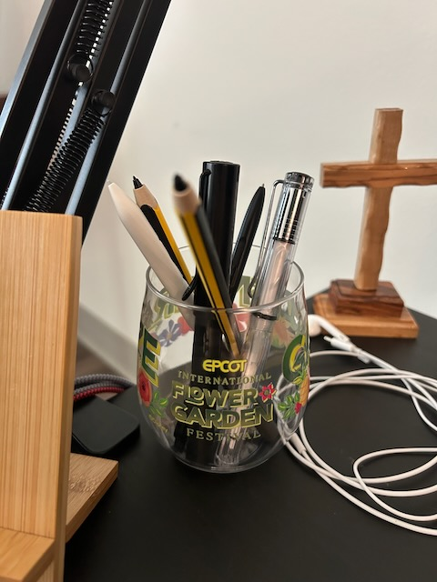

# Everything Will Be Okay

## Morning

I slept okay last night in general. But I did have a nightmare about Malachi that left me a bit disturbed. It reminded me of the struggles I've experienced as a disconnected father...the pain of being excluded from important parts of his life. I've done my best to be involved. It was met with brick walls and closed doors. It's difficult to talk about. Even thinking about it is unpleasant. I think about all the things I could have done differently. What is my part in the disconnection and where could I have been better at certain things? But then I remember I did my best. I wasn't the only one involved to cause the disconnection. I didn't build the walls or close the doors. No amount of pleading opened those doors or removed those walls. It didn't matter what I did or how hard I tried to prove myself. I couldn't get past the *gatekeepers*. Yes, plural.

In the dream, there was also a comforting reminder. I was able to see how much Malachi enjoyed having me as his father. He was never the cause of the struggle. He always lit up with excitement to see me and be with me. I was always there when I was allowed. I put everything on hold when there were things I could be involved in. In a crowd of people who were always there, he'd look for me instead and the excitement on his face was greatest when he saw my proud face and my hand waving in equal excitement. The dream was a nightmare. But I appreciate what it all means to me. It's a reminder that I love Malachi and I am a good father. I am far from perfect and make a lot of mistakes. I'm doing my best, though. I'm looking forward to the next time I get to see him. I'm working on a plan to drive up to Indiana soon. That will be so good for the soul.

Anyway, this has been a rough morning. Even logging into work was a struggle I did not expect...LOL But I got past the technical difficulties and was finally able to get going. And writing all of this out is helping with the anxiety I woke up with. I'm grateful for this journal and how it helps me process things. I'm so glad I took this back up in 2023. And then made it a regular thing last year. And now, I love handwriting these words with the first draft. It has helped me in my growth. Especially with being able to go from surviving to thriving.

## Afternoon

My workday is going well. After those early technical problems first thing, everything is going well now. I had my weekly one-on-one with my boss. We mostly talked about my vacation. We only spent a few moments talking about project work. He admitted that things are pretty quiet at the moment. These times are nice so we can work on things that often get left on the back burner, so-to-speak. I was also able to help someone out on a trouble ticket for an application I support. It turned out to be something with the web browser and not my application. But it was nice to work with the end user to resolve the issue for good. They commented on my profile photo...LOL They really liked it. I use the same one at work that I do everywhere. I told them it was my *so, I was thinking...* pose...hehehe I explained how I journal and write. We also talked about food we were making for the week. It was nice to meet a new person today. We are a large company. So, I've been meeting new people lately.

I mentioned earlier that I'm thriving. Although that is mostly the case, I still have moments when it feels like I'm just surviving. I prefer to be more positive. But I've learned to embrace the negative as well. I won't lean into it and become a negative person. I'm just acknowledging it for what it is and learning what I can from the experiences. When I am able to make things better, I will. When I can't, I'll accept that, even if I'm not fully fine. I read something on Friday that suggests a 13ᵗʰ step in those 12 step programs. Step 0 should be admitting that I'm not fine. At least, I shouldn't deny the fact that not everything in my life is going well or how I'd like things to be. I'll do what I can with what I know while also realizing not everything will be fine in the moment. It does all turn out okay in the end. I truly believe that and stand by my words when I state it. It's just that sometimes the end isn't here quite yet. Everything *will* be okay. It *won't* always be okay *now*. I'm glad God is sovereign over everything. That's how I know everything will actually be okay. So I need to look to Him and trust that I'll be okay too.

Anyway, I'm likely going to make tofu fried rice for my *Meatless Monday* dinner. I had a veggie burger for my *Meatless Monday* lunch...hehehe And of course, toast for *Meatless Monday* breakfast; which I do most mornings...hehehe The veggie burger was the California Garden from *Actual Veggies* brand. And it was delicious.

## Evening

Today's devotional was timely once again...LOL Some of what has been on my heart lately came pouring out in my notes and my personal prayer time afterward. Future self, it's *The Chosen* devotional book 5, day 26...hehehe The rest of my workday went well and I had the tofu fried rice for dinner. I went for an evening walk after dinner. It is too hot for that right now. So I only walked a mile. That's all I did for my walk yesterday too. We've reached *that* time of year...LOL So my walks will be short, if at all...hehehe After the walk is when I did the devotional.

It takes me longer to do those now that I'm handwriting them again. But this week, I'm planning to wait until the weekend to convert them to text and revise the resulting text. I don't usually change much at that point. It's mostly typos and clearer phrasing. I do the same for this blog now. But with the blog, I'll sometimes add and/or delete things too.

I have noticed the tone of my writing has evolved a bit since handwriting. But I see that as a good thing. The more I write in general, the more it evolves. I noticed that as I've re-read last year's entries throughout this year. But switching to handwritten drafts has made a more sudden shift. I feel it is more conversational now. Like writing a letters...hehehe

I now have six digital pens for writing in my Supernotes. The original Supernote LAMY pen I'm using for these journals. I have a similar pen that has a button that I use for letters and the devotionals and Bible studies. The button allows me to easily switch writing tools to the lasso from the pen for quick edits. I have another pen with a button that's smaller and more like a ballpoint pen. I use it for quick jots during meetings. I have two types of pencils I use for sketching. And the sixth pen is a fancy Wacom that's supposed to *rule them all*...or be a be-all type of pen. It isn't all that great...LOL It has a double button. One works as the lasso and the other an eraser. I've found that each of the other *specialized* pens are what work best for me for the jobs they are designed for. The nibs are mostly different for each purpose. I keep them on my desk in the EPCOT International Flower & Garden Festival cup I got with Cherie's seeds last year ❤️

Anyway, I'm enjoying this new workflow. And it is birthing a few hobbies. Or reigniting some old ones...hehehe

## Wrapping Up

Overall, this was a good day. I'm glad to be back to a routine. I'm also glad to be back to work. And I'm glad to be back in the kitchen...LOL The day started rough. It smoothed out and finished well. I'm grateful for it all. Not everything feels fine. But I know everything *will* be okay. God is so good. I love my family. I love my friends. Yes, *everything* is going to be okay ❤️