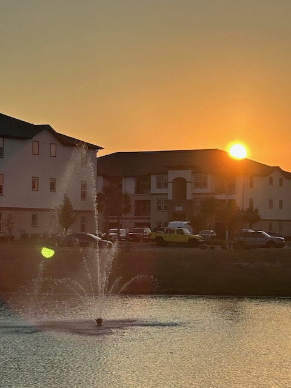

# Today? Not What I Expected

## 11:15am

It has been a pleasant morning. There hasn't been a lot that I expected, though. I took a prayer walk. I've been trying to do that on the weekends since I don't get to do that in the mornings during the week. I do that just in the evenings. Weekends afford me the opportunity in the mornings. My schedule is the reason. I used to take morning walks when I had an earlier schedule. But I'm fine with my current routine. I'm doing a lot of things I couldn't do when my schedule was earlier. I don't really understand how this works. I just feel this current schedule is more *me*.

My bank switched debit card networks and sent me a new card. I received it this week. I spent part of my morning activating it and updating payment information everywhere I could think of. I'm sure I missed a few places. The bank site helped quite a bit with the process. As inconvenient as such a first world problem this was, it was a reminder of how Blessed I am.

It's a beautiful day here. But I'll not be spending much time out in it. I want to get some things done that will keep me inside for the most part.

I was about to start working on wrapping up my notes on the Bible study for the week when I realized I hadn't journaled at all yet this morning. I wanted to jot these thoughts down because my mind was racing with everything I want to accomplish. Journaling for a few minutes has calmed my mind and is preparing me for what I'll do next with my Bible study notes <3

## 1:45pm

I went to Best Buy earlier to look for a tablet stand for my Kindle scribe. As I was looking around, I spotted some phone mounts for the car. I remembered I wanted one...LOL So I grabbed one of those. They don't carry a tablet stand, though. When I got home, I realized one of the folio covers I bought with the Scribe folded into a stand already. So I didn't need one to begin with. I'm still glad I got the car mount for my phone.

I hadn't used my scribe since I got the Supernotes. I had considered selling it or gifting it. But then I started using it with the Bible study. I have the Kindle version of the study. I used the Supernote's Kindle app this week. But since I also use the Supernote Manta for typing, I made use of the Scribe to look at the study as I typed. As odd as this setup seems, it is working really well.

I'm getting a late start on lunch. My day has been a little off from the start. But in a good way. Also, I woke up earlier than expected. No snooze button and I woke well before the alarm was scheduled to go off. I moved it out 30 mins from my normal. But I still woke well before what *normal* was... LOL

## 3:30pm

Sometimes I have thoughts I simply cannot put into words. I'm having such a moment now. I wanted to sit here and write. Yet some of the thoughts aren't coming into tangible sentences.

I just finished watching *this* week's episode of *The Chosen* again. This is the fourth time I've watched it overall. I watched it first during the live event on YouTube. Then watched it again on Prime when they officially released it. The third time was this past Monday. It's a TV show. But I also appreciate how it leads me to pray.

Hosanna... Save me from myself <3

## 6:15pm

I really like how I did the Bible study this week. I divided it into 5 days as before. But I wrote handwritten notes each time and then fleshed out the final typed version today. This basically kept the lesson in the forefront of my mind throughout the week as I processed it. I wasn't sure how long it would take to type everything. But it wasn't time consuming at all. The handwritten notes were converted to text just as I do for my journal into my blog. Then I simply expanded on everything as needed.

I think my sister and I might plan a Disney Day for next Saturday. It has been a while since I've seen her. We don't hang out as often as I'd like. Life happens, you know? I'm glad we are talking about getting together next weekend. I'm grateful for anytime we can be together.

I'm not yet sure what I'll be doing for dinner tonight. I don't have enough to make a full meal at home. I need to go to the grocery tomorrow. Today didn't work out well for that. Sundays are typically best for me.

The Kindle Scribe really helped out today. I'm glad I still have it. It was my first e-ink device. Now I have 5...LOL Each with a different purpose...LOL

## 7:25pm

I just got in from a lovely evening walk. I was able to see Carly (Mary) and Dolci (Jessica). I love to see my favorite dogs.. okay, and their owners too... LOL I was also able to grab a few photos and a video of what I saw last night that inspired the Haiku I wrote. I'm glad I was able to do that to at least show what inspired the poem.

I also saw a bald eagle. It was flying overhead and it was amazing. The backdrop was a set of beautiful clouds with the sunset hitting them from the opposite side. I didn't capture it through a lens. But my eyes saw it.

I haven't had dinner yet...LOL I'd better decide what I'm going to do!

## 10:10pm

Today is Timmy's birthday. He's a dog that moved away while I was in California last November. I reached out to Jan this morning to check in on her and wish Timmy a happy birthday. She was surprised I remembered. She seems to be doing okay. Her husband, Sam, passed away a few weeks ago.

I ended up having Panera for dinner. When I can't decide what I'm in the mood for, that's where I end up. I'm looking forward to going to the grocery tomorrow.

Besides the Bible study, I didn't get around to any of the projects I was looking forward to working on today. But I did clean my bedding today. So I have fresh sheets to look forward to tonight...LOL

## Handwritten Journal

[Today's handwritten journal](/media/blog/2025/09/20250920.pdf)