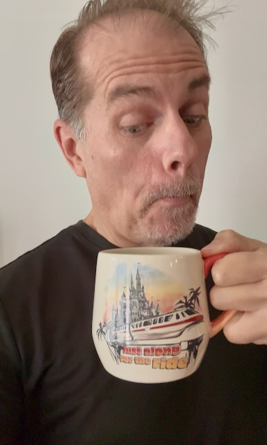

# The End...of White Noise?

I woke a little anxious today. Nothing to worry about because it wasn't anymore than a slight uneasy feeling as if I were just forgetting to do something important. I wake up that way sometimes. As I began to truly be awake, I realized I'm not forgetting anything important...LOL I was probably dreaming about something?

My daily log is evolving nicely. I think I'm close to creating a template to make it easier to start each day. I have things I've done with it everyday. So patterns are emerging. I've started to make heavy use of keywords and headers to better organize the notes. I start a new log note each day so the files aren't too big and overwhelming. I make slight tweaks each day as I think of new things to log or journal about. So I have put off making a template. But I feel I can start a template soon and adjust that as needed. And I can still add to the note after I
start the day with the template.

I'm excited about going to Disney with my sister on Saturday. It has been so long since I've been to WDW. I think it was early June? My sister and I went to Disney Springs in July. But we didn't do any of the parks that day. I miss the parks. I may try to go more often in the coming months. *My* dapper season is almost here...LOL Her annual pass is about to expire. I think they plan to let theirs go. I'm thinking about that again for when my pass expires next year. I've seen the value of going there on occasion with a day ticket instead of frequently on an annual pass. If I were to move closer, then an annual pass would make perfect sense. I've realized my current driving distance isn't actually all that convenient after all. The excitement of that drive has worn off now...LOL I still love Disney and want to go often. It's just that drive that often stops me now...LOL

Hurricane season has been quiet this year. I'll enjoy the calm while I have it. This is the first time in 4 seasons that I haven't dealt with major storms. I'm grateful for what it has been like this year. If I move away next year, I'll be glad to have this calm send off...LOL Learning about these storms while living here has been an amazing experience. One needs to respect their power. But one needs not fear them. Heed the warnings and be prepared. Kind of like life in general. So, my time here has been a life lesson. *Hurricane Greg* has learned a thing or two...LOL

It was 2 years ago when my car broke down and cost a lot to *fix*. Although they got it back on the road, it never quite ran right. Not long after it was *fixed* , it died completely and left me somewhat stranded on my lunch break. I have roadside assistance to take care of such things. I've always had car issues and don't chance that anymore. The cost of repairs was beyond acceptable. I actually still have that car in storage. I'll probably donate it to *Wheels for Wishes* soon. I ended up getting newer, used car after that last break down. And I have since gotten another car. A few months ago, I traded in the car I got 2 years ago for a brand new one. It's a significant upgrade and the best car I've ever had. In a few years, I'll likely switch to having a truck or some sort of larger vehicle. But for now, I'm very happy with The Batmobile... LOL

I had to update and resubmit my self-evaluation for work today. The *goals* I put were *wrong*. We weren't given any direction on that. We were simply told to write up our accomplishments for the past year. I used to procrastinate on these things because I don't like doing them. But I've grown to get unwanted things out of the way as soon as possible now. I did my original self-evaluation weeks ago to get it done and out of the way. Well, my boss kicked it back to me today to change the goals. I've been asking for feedback weekly on this. I'm not sure why it took so long to tell me I did it wrong. It's due in a week. Hopefully my changes are correct. I stress over self-evaluations. I understand it is part of the merit process. But I do wish I could opt-out of a merit increase. I'm grateful for my raises and bonuses. They just don't drive me to work hard. Good work that I believe in is what motivates me. A funny part of the changes I needed to make is that the most valuable, and most fulfilling, contribution I made to the year was going to get axed in the revisions. So I added it to the summary at the end...LOL

I made salmon tacos for dinner. I originally planned to do them for Fish Friday. But Trexina inspired me. I marinated the salmon in ginger lime coco aminos. I topped them with pico and kraut. They were amazing. I'm glad I made the change. And Trexina inspired me to make taters and trout for Fish Friday instead...LOL We'll see if I make that or do something else.

Tonight's walk was slow. But it was amazing. Lots to pray about; which included a lot of just *listening*. The sky was so beautiful. I saw a fish jump out of the water. I also caught a glimpse of a gator. The birds flying overhead were mesmerizing. I'm grateful for a great many things. Especially people. Those still in my life. And those who are not <3

My Supernote Bible project is coming along nicely. Last night I worked on Proverbs and Genesis. Today I worked on Exodus, Leviticus, Numbers, and Deuteronomy. So I now have 13 books ready, including the ones I've already completed before this week. I'm making good progress and I feel motivated to complete the project quickly. And I've already thought of other ways I can work with these files I'm processing for other related projects. When I started this, I had one goal in mind. Now it's multiplying <3

So, a year ago I was thinking about giving up coffee...LOL Although I don't *need* coffee, I do love it. In a way, it's part of my personality, when you think about it. I have a mug collection, I'm known for drinking mostly Joffrey's, and I've featured that *bitter black nectar* in some of my short stories. Not to mention I did a dapper bound as Joffrey's coffee back in April...LOL Needless to say, I haven't given up coffee. I've even changed, and improved, how I brew it...LOL I'm glad I journal about these things so I can laugh *with* myself later...LOL

Something I *am* actively trying to give up is my white noise. I used it for years to sleep. In a way, I grew dependant on it. Which I'm not too fond of, actually. For the past week, I've been weaning myself from it. Tonight might be the last night of the process. And tomorrow might be the first night without it in years. Wish me luck!

## Handwritten Journal

[Today's handwritten journal](/media/blog/2025/09/20250923.pdf)