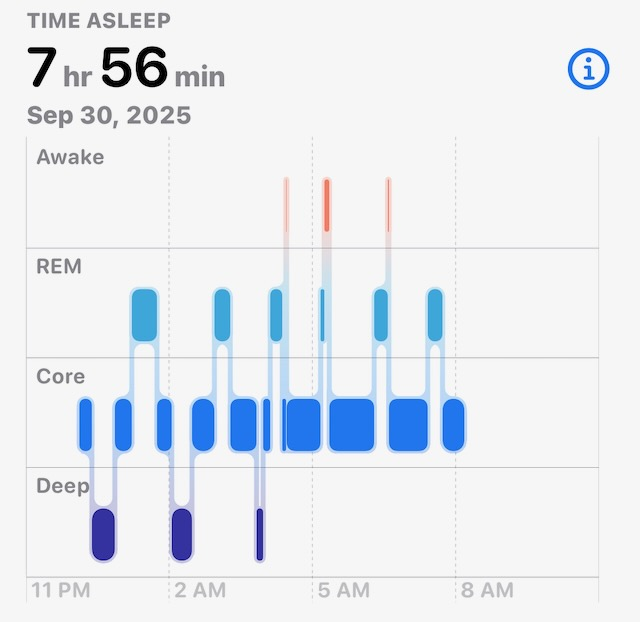

# No Taco, But Super Progress

## 9:30am

I slept well last night. My allergies are a problem. But I think a good night's rest helped a lot. I continue to go without any white noise. I think tonight will be the one week mark for that. I went to bed an hour earlier than usual last night. I'll likely do the same the rest of the week as my body deals with things. I feel great otherwise. Just drained... LOL

I'm not looking forward to the early morning Friday. So it is good I'm prioritizing extra sleep until then. Plus, I'll be seeing my family this weekend. One early morning is well worth that. I've also found that my sleep has been so good these past 4 years that the occasional disruption doesn't really impact me.

## 10:30am

My creative juices are flowing and I'm considering how I can work that into my routine better. I want to make the time to write and do art more often than I've allowed myself to do lately. I've talked about this before and have yet to settle into it. It has been frustrating trying to make time for such an important part of who I believe I am. I sometimes feel as though I'm on a boat adrift in a vast sea of possibility and untapped potential. The horizon on each side goes well beyond where my eyes can carry me. I can't find land by which I can settle and create.

I imagine I'll not complete many of my current book ideas before grandma passes because I think I'm still years away from publishing most of it. She loves to read. So I would like to share my in-progress work with her. Dad says I just need to email her the PDFs and she can read them on her iPad. I think she'II appreciate the short stories I've been writing. So I'll likely start sending those to her even though they aren't *publish ready*. I'll have to instruct her not to share them with anyone. As I write, I only share with a select few. Once something is ready for the public, I'll *put it out there*. My original *Vitamin G* book was something I took offline because it wasn't ready. I should not have ever posted it on my website. It's okay that I did for a while. But I wasn't ready and pushed myself too much to try. It was a good thing to try, though. Otherwise I would not have known I wasn't ready...LOL

Pushing myself is good. Forcing it is bad...LOL You know, a challenge is important. But being overwhelmed beyond the challenge can destroy what I'm trying to accomplish. If that makes sense?

## 11:45am

I'm back to researching neurodivergency and how it might explain my experiences. I'm looking at this as a way to better understand how I can navigate the complexities of my life. I'm not looking to label myself or find an identity as a neurodivergent person. I look for ways to grow and not settle for simply accepting things the way they are, so-to-speak. I don't expect others to cater to me in any way. I'm looking to grow in how I relate to others who think in more typical ways. I appreciate this challenge for what it is. And I appreciate the opportunity to educate myself on how neurodivergency isn't just something one has or is. It's helping me adapt and I love that. The world has become accommodating. For the most part, that's a good thing. But I grew up in a time when that wasn't the case. I feel that helped me because now I know how to look for ways to navigate this myself instead of others figuring out how to include me.

I only wish that others were better at accepting that I don't think the way they do...LOL I feel like I'm accommodating them as a result...LOL Which I'm okay with. After all, I'm the one who's different...LOL

## 3:45pm

I've been on this *kick* of watching old cartoons. It started when I was reading a biography about Walt Disney. Then Instagram started showing me vintage cartoons. And lately, I've also been watching those original shorts on Disney+ from the 20s and 30s. I really love those old cartoons from the decades before I was born. I enjoy things from the 80s and beyond too. But those early cartoons do something different in my heart. Some of them don't even make sense, really. But I love that. I'd love to try my hand at doing a silly animated story like those. Something short...like 5-7 minutes.

That will take me years to do by hand, of course...LOL There is software that would allow me to do such a thing in weeks or days. But I'd love to do it the old fashion way. Frame by frame. But I'd still use a computer to animate the cells. I wouldn't create an actual film reel...LOL Honestly, though, I'm not sure this idea will come to fruition. I just love the idea of doing it. I don't have the passion those animators would have had to have to do all that back in the day...LOL

## 5:20pm

I'm going to have tacos at that Farm to Taco place I tried a few weeks ago. I loved their tacos and considered them *real* tacos. I'll go with the shrimp ones only this time. Those were my favorite of the 4 I tried. I think I'll get some rice this time. I didn't go to the grocery this past weekend. So I don't have any taco stuff to make them at home this week. I have food to make. But I really want tacos tonight...LOL

My tremor has been acting up this week. Not too bad. But noticeable. I could really see it on a video I made the other day. I'm not worried about it, though. This happens from time to time. And it hasn't impacted me very much. It's just something I've noticed. I am still able to hand wash my dishes and hand write these words. I'm grateful for the improvements in my health these past few years. I'm glad I made some good choices to improve my quality of life.

## 6:25pm

Well, no tacos for Taco Tuesday. Farm to Taco was closed. I don't know if that is a permanent thing. Or simply something for today. I was too hungry to drive all the way home or try to find another taco. So I ended up at an Asian Bistro I've been to before. I was sad about the taco. But Asian food makes my heart happy. I ordered sashimi and shrimp lo mein. I'm having hot jasmine tea to drink. Maybe I can make tacos next week.

I ended up tossing my headphones. The new cushions didn't work out after all. So I ordered a new set of studio headphones. Those should arrive tomorrow. I think they'll turn out well. These include a microphone. That'll be nice should I ever decide to use them for calls. My previous studio headphones didn't have a mic.

## 7:55pm

It sounds like the government is shutting down tonight. This potentially impacts my travel plans. It may have little impact this weekend. But the longer this takes, the more likely it will impact my plans in November and December. I already have flights scheduled in November for my vacation with Cherie. The December plans are still pending. It's holiday travels. So worst case there, I'll drive. I may just decide to drive anyway. I just hope this weekend and November go as planned.

I was so sad to not have tacos tonight. Not *boohoo* sad. Just sad for unmet expectations. I'm grateful for the food I did have. God is good. I'm not going to sugarcoat it. I don't like that I didn't get tacos...LOL I checked the Farm to Table website. There wasn't any sad news. But there wasn't a sign at the restaurant either. So, I'm unsure why they were closed. Especially on Taco Tuesday.

## 8:20pm

I can't believe how sad I am about not having tacos...LOL I keep thinking about it...LOL I really hope they are okay. I loved the place when I was there a few weeks ago. They were so friendly. And the tacos were fantastic. I'll be truly sad for them if they close. Whatever reason they were closed this evening, I can't imagine it being something good. Unless they are all family and had some sort of event. But one would think there would have been a paper sign on the door with an explanation had it been planned. I hope they are okay.

Anyway, the Dodgers play tonight in their first game of the post-season. How great would it be if the World Series match-up were to be the Dodges and the Red Sox? In my family, it would be me against my sister and her husband...LOL I would love that!

I'm going to try to make more head way on my Supernote Bible project during the game tonight. I only got 2 books done last night because I was so drained. Perhaps I'll make good progress tonight.

I'm unlikely to see the latter half of the game. I think I want to be heading to bed by midnight again tonight. My body could use the rest. I got about 8 hours of sleep last night. As you can see from the chart below, my body went through a fascinating rhythm last night...LOL

## 10:20pm

I have finished 12 books with my Supernote Bible project. Since I only have 7 books left to do, I've decided to finish those tonight. A lot of these are the shortest of the entire Bible. So it doesn't take long to process them.

## 10:40pm

I did it! I completed this stage of the project. All 66 books of the Bible have the format I wanted to work best on my Supernote devices. Next I'll confirm all the files. And then I'll tackle the task of merging them all into a single file. As of now, they are all in individual files. The merge stage shouldn't take long. Maybe one or two sessions of *work*. I'm excited this is coming together so nicely <3

The Dodgers are owning this game! I won't get to see the entire game. When these are on the west coast, I don't usually get to watch through to the end. But that's okay. I'm grateful I can see that parts I am able to.

## Handwritten Journal

[Today's handwritten journal](/media/blog/2025/09/20250930.pdf)