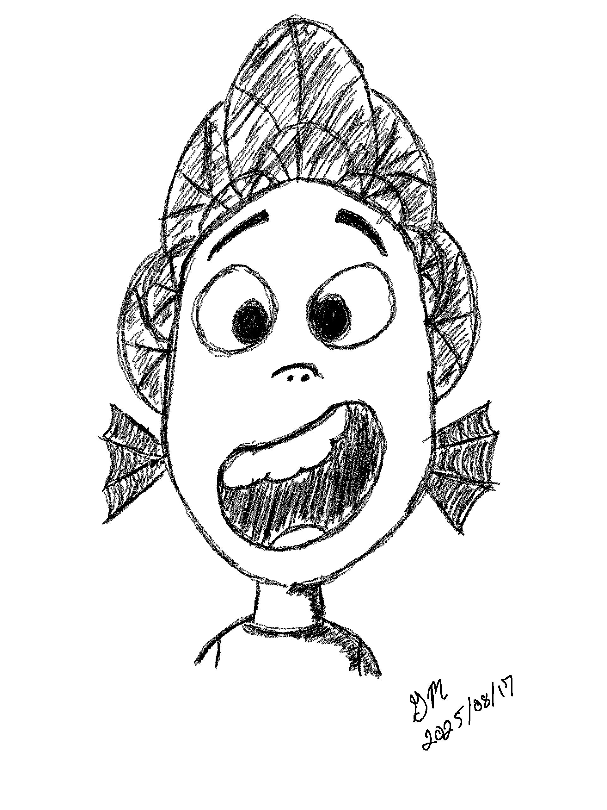

# Distractions, Soliloquy, and Digital Art

## Distractions

This morning, I was pondering if I find a certain comfort in distractions. It would seem that a great many things are distracting me lately. Yet, I'm also very comfortable with that. This has not always been the case. So I wanted to think about this contrast a little. I haven't yet come to any conclusions.

Yesterday, I began researching *signal to noise ratio* in the context of my life. Those things most important to me (the signals) and how they go up against distractions (the noise) has been coming up often this year. As I was talking about this with my boss yesterday in the context of our jobs, he put me onto the *signal to noise ratio* concept. I had only ever thought about that in technical terms. But I connect with it in how I respond to my life. Again, I have yet to come to any conclusions.

## Soliloquy

So, I was thinking...

I used to post on social media *for* others. It was basically *content*. Even my *Vitamin G* started as content in a way. That eventually evolved into more personal, and genuine, connections with certain people. Some of those people have become close friends. Especially my best friend. But now my social media has become more of a series of soliloquies that reveal my inner monologue. Much like this blog is. And now that I think about it, my social media became what it is at the same time as I began journaling.

I'm constantly and consistently thinking. Writing out my thoughts has been therapeutic and helped me grow these past few years. Along with my pursuit of a deeper relationship with God. I'm happy to share these things in the *public* because I don't think we are meant to bear life alone.

Social media has mostly become an echo chamber where no one is listening and no one is being heard. Yes, I'm dangerously generalizing this...LOL It isn't literally *no one*...LOL I feel it important to share my random thoughts sometimes. Perhaps *someone* needs to *hear* what *I* have to say. And when I go through my feed, I'm trying to *listen* to what *others* have to say. I enjoy the different perspectives people have. As long as I keep a healthy mindset, I can *consume* these things and be a part of the *conversation* when a true conversation takes place.

But when a conversation isn't possible, I'll continue to happily talk aloud the many random thoughts I have. I'll never stop thinking. And for now, I'll not stop writing.

## Digital Art

I've been fascinated with digital art ever since I got my iPad and Apple Pencil. Likewise, I've been frustrated with digital art ever since I got my iPad and Apple Pencil...HAHAHA For a while, I would use my iPad to do the concept work for my canvas paintings. It helped me better visualize what I wanted to create in the physical world. Although it helped with that stage of *my* process, I really struggled with the experience of the stylus nib on glass.

My hopes were restored when I started using e-ink tablets this year. I've enjoyed sketching on my Supernotes. And I even bought a Paperlike film to put on my iPad to help with that experience. However, I never settled back into digital art on the iPad because I learned that e-ink was improving my mental stamina while the other screens were draining me. I couldn't find motivation to be on my iPad...LOL

My recent *investment* into color e-ink tablets restored my hopes once again. My initial experience was lackluster because the native apps designed for them were primarily for note-taking. Their ability to do art falls short. YouTube videos showed some decent abilities. But it doesn't work great for me.

I think it was last night when I installed Infinite Painter, a third-party app. I've tried it on both of my color e-ink tablets. It seems to work really well on the Note Air 4C. I had to tweak some things. But it gives me hope. On the Tab X C, it *works*, but the stylus-to-screen experience is like the iPad. So I've ordered a film to apply to its screen to help with that. As for the Note Air 4C, it allows me to use my EMR pens from my Supernote devices. When I use my EMR *pencils*, the feel is amazing.

I'm looking forward to exploring this more in the coming weeks. Especially as I design our Bingford sticker. E-ink has transformed my writing. Let's see how it transforms my art.

This new excitement in digital art inspired me to post a sketch I made in August when I got home from our vacation. On my Supernote Manta, I recreated the sketch inspired by Alberto from Disney/PIXAR's "Luca" that we did at the Animation Academy in Disney's California Adventure. I posted it in the Supernote subreddit as "Superart". There have been others posting theirs lately too. I decided to join in...hehehe

