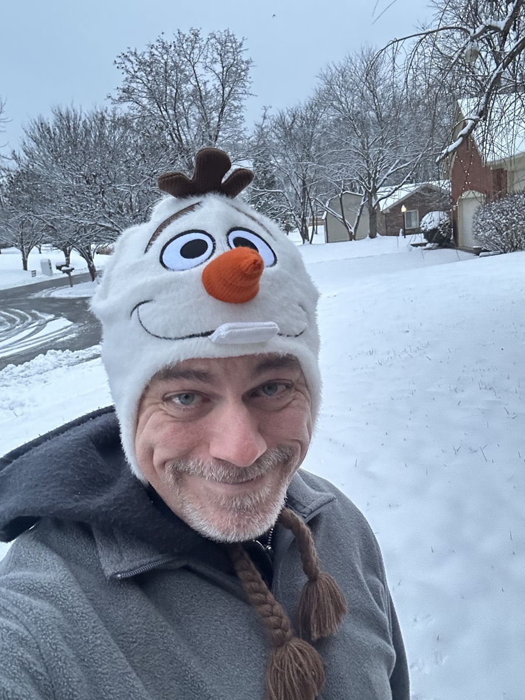

# Happy Snowman

### 2025/12/02

I'm not sure why, but I'm getting really good sleep this week. Even when the heat went out the other night, I slept right through the chill. This is the best I've slept on one of these trips in the nearly four years I've been visiting. That's making me a happy snowman... hehehe

Speaking of happy snowman, I'm enjoying the snow. I'm a bit surprised... LOL The weather here is one of the reasons I chose Florida... LOL I wanted to get away from the cold and snow. I've always enjoyed snow in photos. But experiencing it wasn't always the greatest. I suppose moving away gave me an appreciation for it. That said, I still do not want to build a snowman. I'll stick to my Olaf hat... LOL 

As I continue reading last year's journal, I am reminded how well last year was paced. As I've mentioned a time or two, I consider it the best year of my life. And it didn't go by fast or slow. It was well balanced throughout the entire year. By contrast, this year has been more chaotic in its pace. Sometimes it was slow, sometimes fast, and sometimes it was just what I like. And the events and experiences this year have been equally chaotic. I'm not saying that's a bad thing. It just hasn't been how things were last year or at all as I hoped the year would go. Some very amazing things have happened. Some not so amazing things have happened as well.

I'm just thinking out loud, though. It has been a great year overall. Even in the struggles I've faced this year, and the ones I'm facing currently, I remain a happy snowman. I'm grateful to have witnessed and experienced God's goodness in the lives of my loved ones. Especially in my best friend's life. My heart is so happy right now. And that inspires me through my struggles.

Some may find it odd that I'm happy at the same time as I'm struggling. *It is what it is and it ain't what it isn't.* I've been through so much in my short life that I'm able to find happiness and contentment no matter how things are going otherwise or how I feel about things. I'm a cup completely full kind of person now. It isn't half full or half empty. In fact, it's overflowing. I hope the joy I often feel overflows and pours on others. I want my presence to be a warm hug <3

I'm not always happy about how things are or how things are going. And even though I'm always right where I'm supposed to be in the moment, I'm not always happy where I am. But that doesn't mean I don't always find happiness. My shift into *expecting nothing and appreciating everything* has been a life changer for me. It helps me find the goodness God has for everyone; including me. That truly makes me a happy snowman.

Today was full of things that made my heart happy. Even though I didn't play in the snow, I loved taking photos. I even enjoyed cleaning my car off for the third time. I imagine my car is surprised by snow... hehehe Like Jack Skellington... LOL "What's this!? What's this?!" LOL And I was introduced to Art Carney's "Santa and the Doodle-Li-Boop" LOL I ate lunch alone today. But I had a lovely time of it in Mom and Dad's kitchen. I took Bingford out for snow photos too... LOL I had food from my favorite Chinese restaurant here in my hometown. And I was able to *paint*.

Something I loved seeing last night was all of the Christmas lights with the snow. There was one yard where they put lights throughout their front lawn and the light bled through the freshly fallen snow. It was so amazingly beautiful. It's definitely something you don't see in Florida... LOL I love Christmas lights and I can't wait to see more. I see some of that in Florida. But it just isn't the same. The exception is how well the theme parks are decorated. So I'm glad to see Christmas at the parks.

I received my new desk light today. It's different than the one I use at home. I really like the *light* that comes from it. I need to find the perfect orientation on my desk for it still. I like the stand and neck for positioning it. And the switch is a touch button, instead of a real button. I prefer real buttons. But the *light* coming from it is the most important part. So it works well for what I want while I work from Mom and Dad's. I'm a happy snowman... hehehe

We ordered Bing's for dinner tonight. I have that on most of my long visits. I asked for chef fried rice, intending to eat some tonight and some tomorrow. Well, for the first time ever, they gave me the wrong thing... LOL They got Mom and Dad's correctly. Since I didn't discover the error until we got home, I went ahead and ate what they gave me... hehehe I've been friends with them for over 30 years and this is a first. I just find it funny and now it's part of my story.

While watching TV with Mom and Dad, I worked on a *painting* idea I had on my drive last week. I saw a Christmas decoration on a street light in a small town I drove through that looks like a Christmas tree. It was made of garland with a gold star on top, green for the tree, and a red base. I added a single red ball hanging on one side just to be cute. And I did a feather brush of whites and blues for a background. I tried to make my tree look like garland too. I love how it is turning out so far. I'll do a little more work on it this week before I consider it finished. Mom thinks I should make Christmas cards... hehehe

I still need to work on the Christmas card I'm planning for the exchange with Joann. She always sends a beautiful card of her family. I loved meeting them all at EPCOT a few years ago. I wanted to send an original art Christmas card this year. If it goes well, I may start making a few others to send to *everyone* starting next year. And maybe special ones just for those special people in my life. You know...a warm hug, just for them. We shall see... hehehe

I had one of those days at work when I feel like retiring from my tech career... LOL I've run into a stupid issue that makes me hate technology of *today*... LOL It's a security related thing. But I think the problem is in how Microsoft handles special characters in generated secret codes. I hope to resolve it tomorrow. I think I may need to pull in the vendor to fix it. 

Overall, this was a good day and I'm a happy snowman. And as you can see by the photo above, I finally found a way to add photos using my new publishing technique... hehehe