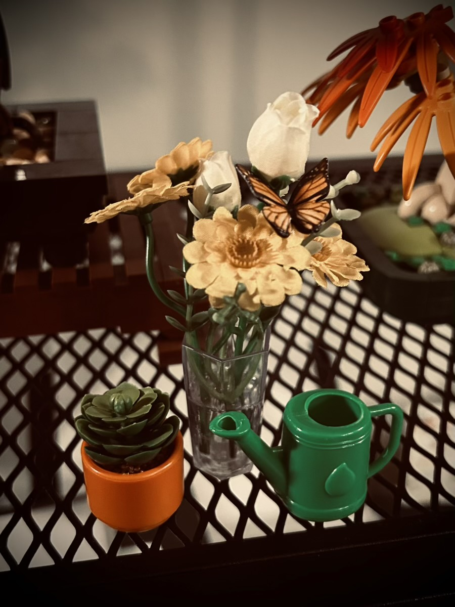

# Full and Happy

### 2025/12/08

I've been sleeping really well. I wake up feeling rested and I have good energy all day. And when a night like the one last week happens, I still do well overall the next day. I've even cut back how often I have an evening cup of coffee. My dreams have been okay too. I haven't had a nightmare in a while. And the nocturnal nature of Bingford doesn't seem to wake me often... LOL j/k

I had a pretty productive day at work. I already feel like this will be a good week. That could change, of course... LOL But with a good start today, I feel good about this. I did have one stressful moment. But I sort of walked away for a bit. Basically, I got up and did a walk around the apartment to regroup. That did the trick. And by the end of the day, I met a goal... hehehe

During my lunch break, I read through this week's Bible study lesson. I normally watch the episode before doing that. But I'm glad I switched that up this time. Although I had seen it months ago when it first became available, reading the script in the lesson gave me a better perspective than had I just watched it before reading. I watched the episode during dinner and then worked through the first section of the lesson. It's good to be back at our Bible study.

After work, and before dinner, I made a small grocery trip to get some food for the week. It turns out Publix has quite a few of the brands I get at Sprouts. I knew they had a few. But they had everything on my short list tonight. That's good to know! And I'll be looking for more of my trusted brands there. They are much closer to me than Sprouts. But this is mostly for my quick trips. There are still things only Sprouts carries around here. So don't worry... Sprouts will still get my business... LOL

After my Bible study time, I worked on a little botanical thing Mom got me last week. I only did one of them tonight. It actually came with 3 sets. It's cute and became my featured photo for today. I'll work on the other 2 later this week. I'm finding joy in taking my sweet time with such things.

Speaking of joy, I used my new Disney mug for the first time today. This was my first time making coffee since Thanksgiving. Since it is a Christmas mug, the season has arrived to use it. I'll likely use it quite a bit these next few weeks. On our November vacation, Cherie gave me the idea to rotate my mug collection with the seasons. Thank you so much for that idea, deer friend. It's perfect for me and my growing collection... hehehe

After my botanical creation, I worked on 2 art pieces. I wanted to do 3. But ran out of time... hehehe The first piece was my Christmas Tree. I changed the star and ball to better match the tree and base. I'm still not done with it, though. It isn't quite what I envision just yet. The second piece is for the Christmas card I'm making. All I did with it tonight was a basic concept of what I want it to look like. I think it will be cute. I'm using the new (to me) art app for that one. It was fun to work on these tonight!

Now I'm writing this journal entry. I feel full today. I feel as though I've done most of what I hoped to do with the time given to me today. This doesn't always happen. In fact, it's rare... LOL My heart is full and happy <3