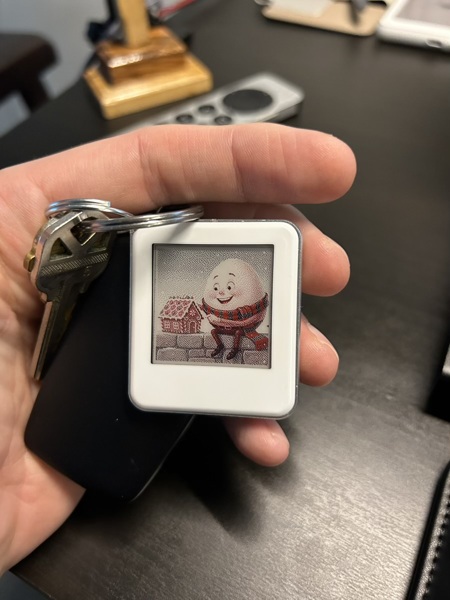

# Milestones on My Journey's Path

### 2025/12/10

Back on Thanksgiving, I mentioned that I heard from Mack and how he said he had become available to hang out on the 13th. Well, that would be this weekend! Yay!!! I haven't seen him in a while. So long ago that I don't actually remember when... LOL It was earlier this year, though. I seem to recall it might have been a race weekend. And I remember wearing a green dapper outfit... LOL

I decided to make this weekend a mini vacation. I'll be staying in the Drury Plaza Hotel at Disney Springs. I've not stayed at this location before. I'm very excited about it. The photos look amazing. It looks like I'll have some sort of terrace to enjoy from my room. They have some other fancy rooms I may try someday. Their suites are a fraction of the cost of basic rooms at many of the Disney owned resorts. My room for the weekend isn't super fancy or basic. It seems amazing for the modest price... modest price by comparison to Disney... LOL

I've only been back a few days and I'm already having a new adventure... LOL Not to mention how I'll be going back to Indiana in 2 weeks. I'm looking forward to slowing down in January. I do love to travel, though. It has been great since my breakthrough in California in July of 2024. But it will be nice to put months between trips instead of weeks or days... hehehe

Things pick back up in the Spring. And I can't wait for those trips. April and May will be travel busy. And I'm considering travel in March. January and February rest will be good. And the rest in June. I'm feeling really good about all of this travel. Especially my California trips. Those renew my spirit and there is an inexplicable peace that I feel there.

These last few days have had an peace as well. I feel really good where I am right now. This is in contrast to how I used to feel and talk about where I live. I suppose it was almost a year ago when I finally stopped feeling so bad about this place. Not long before then, I thought I'd be moving this year. Not only did I not move, I'm considering not moving next year too... hehehe I had talked about moving for a few years and now I'm talking about not moving... LOL

I'm doing my mental retrospective and introspective review of 2025. And I'm preparing for 2026. Although this wasn't the best year of my life like 2024 was, I love 2025. It was a great year. I'm glad I made resolutions this year. A few dropped quickly while some are going strong still. Not bad for my first time... LOL I'm thinking about doing the one per month in 2026. They'll build on each other. I'd do one in January that would continue beyond. I'd start another in February as I continue January's, with the same in March along with February's and January's. And so on through the 12 months. By December, I should have 12 resolutions going in balance. At least, that's the hope... hehehe I've been growing these past few years. I'm happy to continue that momentum.

Will I laugh at myself a year from now when I read that? I've been laughing at myself from what I wrote a year ago. And even then, I was laughing about what I thought the year before. These retrospectives and introspectives are a good way to grow. I don't laugh in haughty derision at my naivety. It's more of a sense of "look how far I've come." I'm grateful I write out my thoughts. And I'm grateful I'm reading them a year, or years, later. They are like milestones along my journey's path.

I got another eink device.... hehehe This time it was something just for fun. It's a tiny little thing that displays a single image. I have it on my key ring. Although it is electronic, it doesn't actually have a battery. Since e-ink doesn't require energy to continue displaying, no energy is needed after the image is set. And to set it, I just use my iPhone's NFC feature. That wirelessly powers the device, transfers the image, sets the display, and then it's good to go until I want to change the image. The app converts any image I want to a format that works well. The screen is only capable of displaying black, white, and red. However, through the *magic* of dithering, the mind sees many colors. It's really amazing and a fun little gadget. For today, it's displaying Humpty with his gingerbread house from his tale today... hehehe

Humpty Dumpty Day is one of my favorite things to do. I appreciate that we have this. Thank you, Cherie, for inspiring me each week. We have so many tales already written. And I'm sure many more to come. *Our* journey together has been amazing. And having this be a part of it is definitely a milestone on *my* journey's path that I cherish <3

I've done a little more work on my Christmas card art. I'm enjoying the process and love how it is turning out. I like the black lines I'm working on. The colors are good. I'm trying things and seeing what works and what doesn't. It's nice to have layers. I can show and hide things as I go. And remove things by simply hiding instead of deleting or erasing. Experiments all go on their own layers. And it all started with a (virtual) pencil sketch; which is its own layer. I'm keeping the sketch as part of the final work. But I'm working in those black lines to make some of it really pop... hehehe

I'm switching back to my Kindle Colorsoft for reading tonight. I've been using the BOOX Go Color 7 II for a while now. But I thought I'd give the actual Kindle a go for a while again. It feels and works a little different. I like the BOOX device, but it's using the Kindle app. The actual Kindle device has a slightly different way that feels more book-like and not so much like an app. So I'll compare it for a bit by going back to an actual Kindle.

This has been a good week so far. I'm grateful for the mercy and grace God has gifted me. And I'm grateful to witness and experience His goodness. That has been sort of a theme this year, hasn't it? God is good, all the time. And all the time, God is good. His steadfast love endures forever. His faithfulness is unmatched. I am Blessed <3