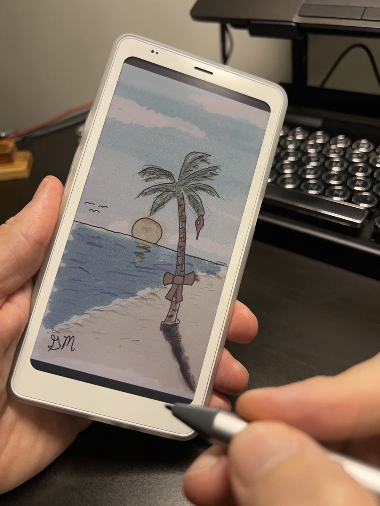

# Christmas on the Beach

### 2025/12/11

I finished the art piece for the Christmas card I'm sending to the Salas family. I've named it "Christmas on the Beach." I'm really happy with how it turned out. I'll also be submitting it for an art contest at work. I created it entirely on my Palma 2 Pro eink device. I'm impressed at how well that works. I feel like I'm onto something with this process. I still need to work on how best to capture the final image to be used for displaying the art I produce with this method. But I'll figure it out. And for now, I'm still quite happy with the results.

I also finished our Bible study today. It's bittersweet, really. We won't have another *The Chosen* study or devotional for quite some time. This week's lesson is the last for this book and season. The next season won't be available until late next year and on into 2027. We'll find something else until then. We'll wrap this one up on Sunday. And after that is Christmas. What a great way to finish a great year.

I wrote this brief entry just before bed *last night*. I'm publishing it the next morning. With my possible goal of journaling everyday next year, and my limited time last night, I felt I wanted to journal without the pressure of publishing right away. That's how I would approach it next year if I journaled daily. I may not publish things right away...hehehe I had two important (to me) things I wanted to say about *yesterday*. This entry is the result. And I'm happy I did it <3