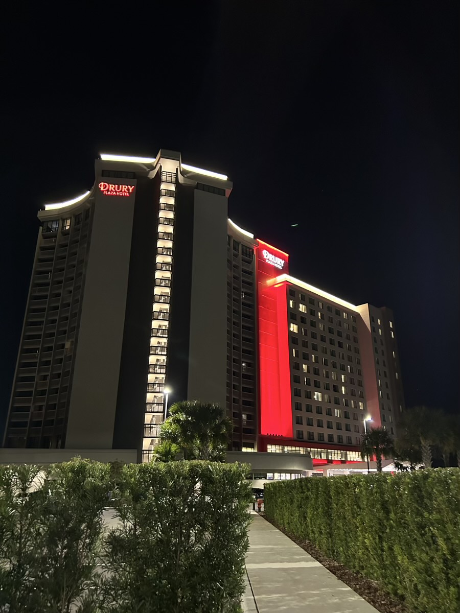
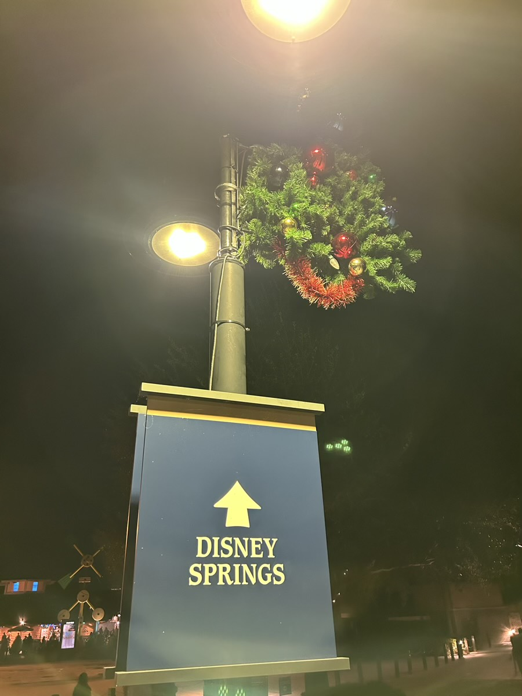
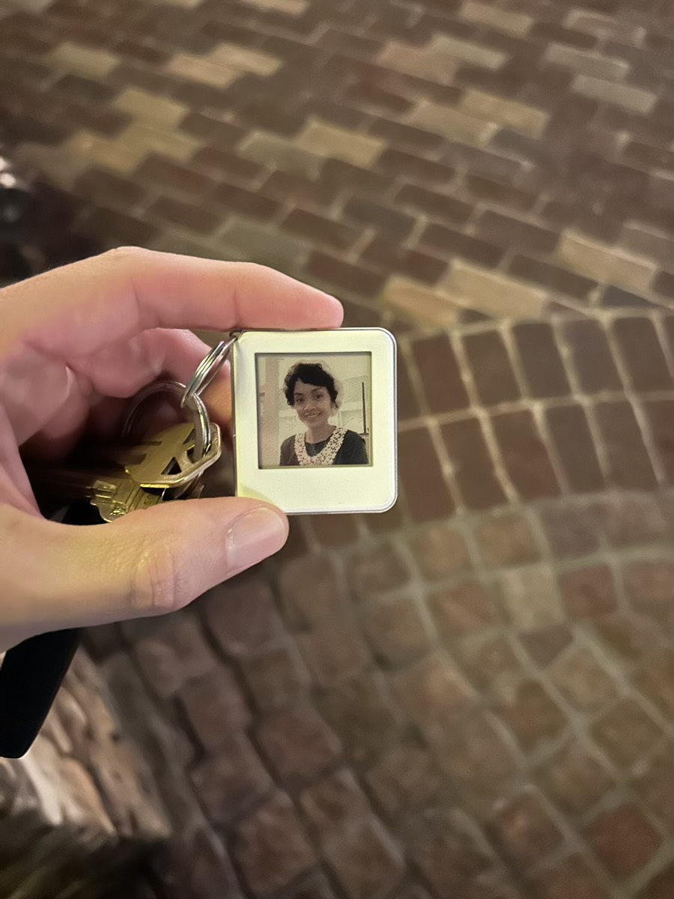
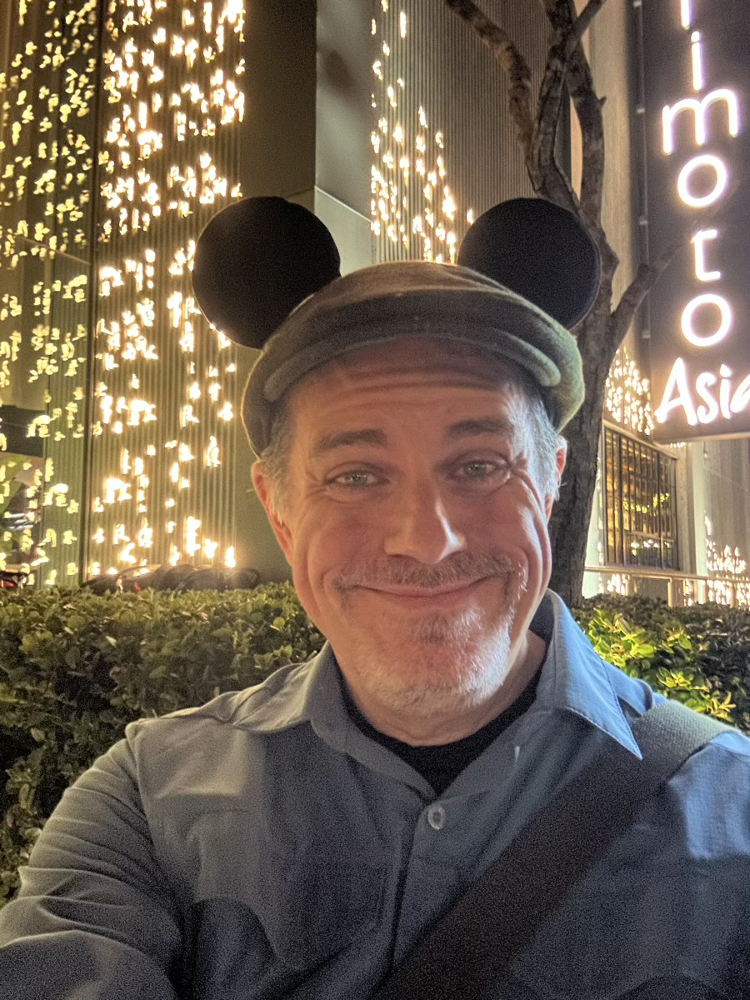
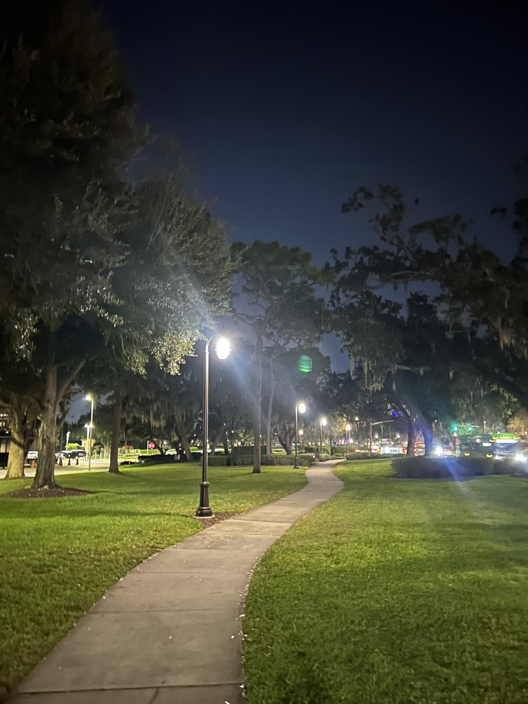

# Magical FriYAY and My Tiny Deer

### 2025/12/12

I had a very productive day at work. That's unusual for a Friday actually. It's usually *busy work* to finish the week and prepare for the next week. Today felt more like a Tuesday... LOL That's a good thing. But enough about work... LOL I'm on vacation! At Disney World!

A Magical FriYAY to start a Magical Weekend. I arrived at the hotel around 7:45pm I believe. The Drury Plaza Hotel is easy to get to and gives access to the *Disney Bubble*. It's not cheap. But still less than what Disney charges. I love this hotel already and my room is amazing! I think I'll just move in... LOL I kid, of course... hehehe

After I unpacked, I walked over to Disney Springs for dinner and some Christmas shopping. On the way, I came across a section of the sidewalk with active sprinklers going. I joked with the others on the path with me that we were on "Splash Sidewalk"... LOL I only got a little wet and was dry within minutes.

Disney Springs looks amazing right now. I wish I had left sooner to come so I could have enjoyed it earlier in the evening.

I always share these trips with my deer friend. Since I have that new eink key ring, I put her picture on it so I could take her along in a new special way. It's like having my tiny deer friend with me... hehehe Thank you, Cherie, for coming along in a new way... hehehe

I had dinner at Morimoto Asia. This was my first time trying it. I've been wanting to for a while. My first impressions aren't great... LOL I'll not go into my experience right now. I'll probably write about it next week. It was *good*. But I have some thoughts about the experience. I may need to give them a second chance sometime later.

After dinner, I did some Christmas shopping. That was very successful, I got more than I planned... LOL But let's just say, Malachi's Christmas is extra special this year <3 I came with a list and managed to check off most of it. I may do a little more shopping throughout the weekend. I have a few more ideas and a few checkboxes yet to get checked off... hehehe

I was reminded tonight that my path isn't always straight. But I'm always where I'm supposed to be. And I'm always heading to where I'm supposed to be going. God is my guiding Light on my path. I'm grateful for the journey He has given me. And I'm grateful for everyone who as joined me along the way.

