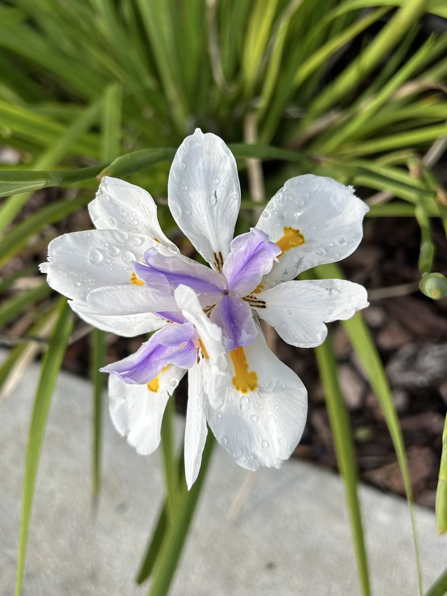

# Really Good Weekend <3

### 2025/12/14

Today is my Great Grandmother Lucille's birthday. I sure do miss her. I cherish all of the memories of her. Especially our strawberry patch. She is such an important part of my life. I'm so grateful she was part of my journey. I love you, Grandma Lucille <3

I had a really good weekend. My heart is full and happy. Last night, I was very tired from a day at the parks. So I asked Cherie for inspiration as to how I should spend my morning today. She led me to Wilderness Lodge and I took her on a tour through some videos. It was an amazing way to start the day. After a great breakfast at my hotel, of course... LOL After Wilderness Lodge, I made my way to EPCOT to enjoy some festival food for lunch before heading home for our fellowship time <3

I'm exhausted now. I'm looking forward to sleeping tonight. I didn't sleep all that well this time. I got to thinking about why and I believe it was due to staying up later than I have been lately. The problem wasn't actually poor sleep as much as lack of sleep, coupled with a weekend of activity. Bed is sounding great right now <3

We wrapped up our latest Bible study today. I loved our discussion today, as usual. Now I'm excited about what's next! Cherie found something we will be doing next year. She has ordered the book and will be sending it to me once she receives it. This was an answer to prayer <3

I made a handful of sketches this weekend as I was inspired. I'm thinking about turning them into art pieces in the style of "Christmas on the Beach" that I made last week. That will connect me to some moments I had this weekend and give me practice for *my* style <3

In my haste to leave Friday, I forgot to wash the dishes from my lunch that day. I came home today with a sink full of dirty dishes! Yuck! LOL They weren't too bad, though. I always rinse my dishes as I use them. So they weren't disgusting and didn't attract bugs. It only left me with a *minor twitch* when I saw the sink upon my arrival... LOL I've been hand washing my dishes for just over a year now. That makes my heart happy <3

I'm just a few weeks away from successfully featuring a photo every day for 2025. This feels like quite the accomplishment. Not every photo is amazing, but each has meaning. I think it showcases my year well for the most part. With 365 photos, I'm not going to remember every moment I captured through a lens. But I'll remember the best moments and have a photo to draw me back to them. I'm thinking of publishing a photo book of them all...2025 as seen through my lens <3

Never stop praying. It's aligning your heart with God's. Prayer isn't about what God will or won't do. It's more so about preparing your heart for what He is already doing <3

