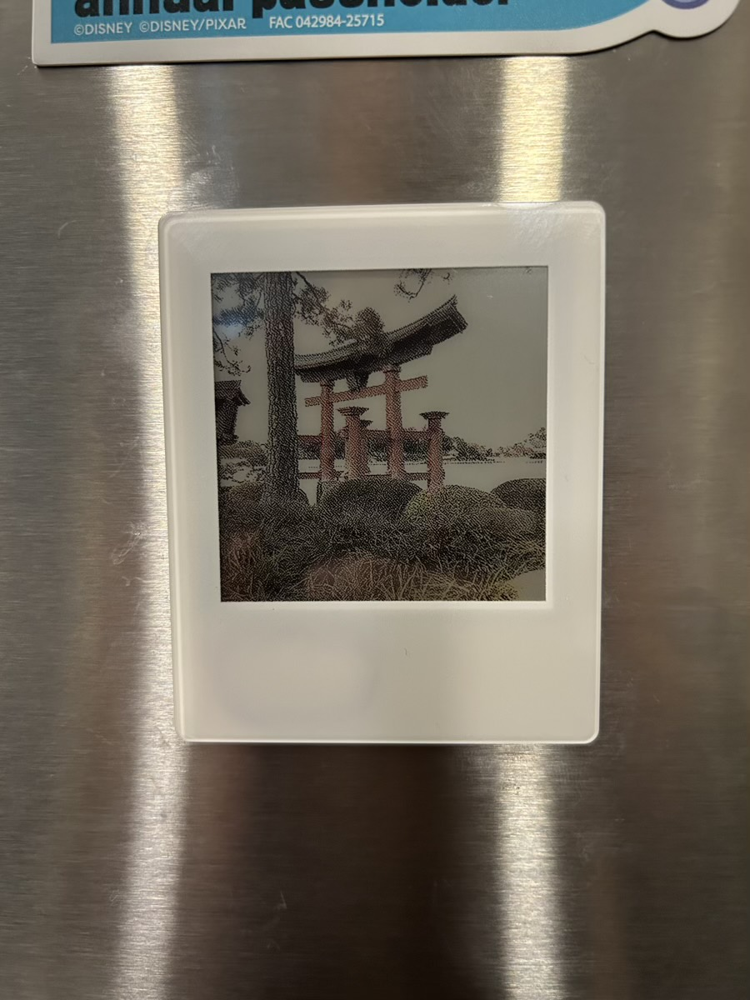
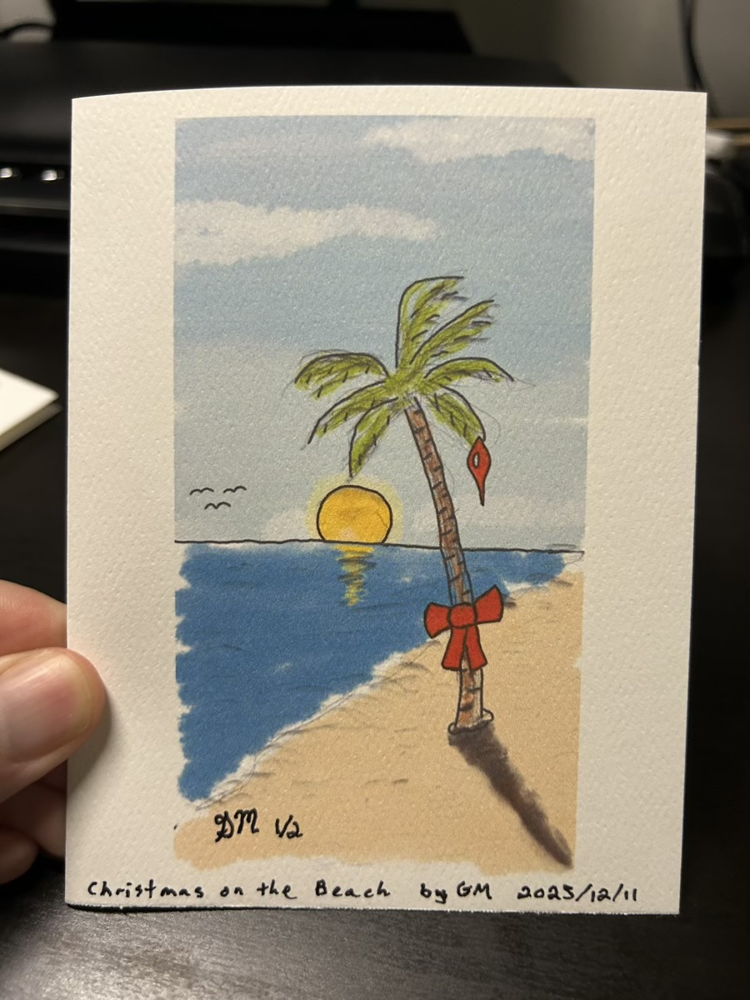

# With Every Christmas Card

### 2025/12/16

I received my latest e-ink device today. This one is a photo frame that goes on the fridge. It's cute and reminds me of a small Polaroid. Like the tiny one I got last week, it uses NFC to power it, transfer the photo from my phone to the frame, and then set the display to show the photo. So it doesn't have any batteries. But unlike the tiny thing I got last week, this one has trouble to get it to actually work. I have put 6 different photos on it to try it out. It took probably 50-60 attempts to get it to work. With a 90% failure rate, it's probably the worst product I've ever owned that sort of works... LOL This is a common problem with the product. I knew that when I bought it, actually. Even the instructions explain how tricky it is... LOL But when the photo displays, it's fantastic... LOL I won't recommend the product. But I'll keep it. As I said, it's cute... hehehe

I printed the Christmas cards tonight. I love how they turned out. In ink, I named, initialed, numbered, dated, and signed the work. I only printed 2 final copies. I destroyed the test prints I made. This is true art. They only exist as intended. *1 of 2* went to Joann's family as she is the inspiration behind the work itself. *2 of 2* went to Cherie's family as she is the inspiration behind the style I went with and provided valuable feedback along the process to create the work. Interestingly, both cards will live on opposite sides of the continent... LOL

I enjoyed this so much that I would like to make it a tradition to make a Christmas card to send. I'd even number them as I did this time. To an art collector, the number would matter. But the number would not represent how important the recipient is to me. Getting the first one wouldn't really mean they were my favorite. So perhaps I should always keep the first one starting next year... LOL

I began work on a poem today. I hope to get it completed before my trip to Indiana next week. Poems aren't quite like my other writing. When the inspiration hits, I like to get it out more quickly.

This one isn't so much raw emotion as it is playful. It's not quite the same as the Humpty Dumpty Tales each week. There is deep, but light, meaning to this one. The spirit of it is about gratitude, hope, and becoming what we are meant to be through our growth in the struggle. When we don't give up, we can grow in hope.

I'm grateful for the process that has led to where I am today. The poem is a small, yet important, step on the journey.

It feels good that my creative juices are flowing right now. It has been adding to my life. I feel a sense of relief from a sort of pressure building up in my spirit. Not a pressure to want to perform. It's like a metaphorical way to describe a build up of ideas like a pipe is about to burst... LOL I have no idea if I'm explaining it well. But it's a good type of pressure and I love the relief I'm feeling through what I'm creating.

Everything I'm currently working on is an expression of joy. Some of what I've created in the past was a way to cope with pain. But now I'm expressing happiness. This feels great and I hope it continues for as long as it can. And I hope what I create can bring joy to others. Sort of like a warm hug. After all, that's what I call it when I give something to someone or when I do something. It's all a warm hug... hehehe

Aside from the gift of Life I've received from Jesus, the best gift I've received for Christmas is my little cross from my best friend. I take it with me on my trips. It's on my desk during the day and on my nightstand while I sleep.

I don't carry it with me when I'm out and about. But that thought has crossed my mind... no pun intended... LOL It isn't the cross itself, though. It's what that cross represents. I used to just look up as I prayed. Now I look at the cross.

There isn't any power in it and it isn't alive. It isn't an idol by any means. It's simply the window I look through to see God as I talk to Him about everything. It's a symbol of His Love. Nothing more. Nothing less.

I had never owned a cross before, this one has been with me most days for almost a year now. It's a great reminder of God's presence in every aspect of my life. He gave that to me through my best and deerest friend. Thank you Cherie for the gift. I've cherished it everyday.

I've written in this journal everyday this month. The only time I've written everyday of the month this year was January. Wouldn't it be cool if I did it again here in December... hehehe I don't recall ever doing that last year. But I'm still considering a resolution to journal everyday in 2026. Perhaps it's good that I've started that pace already... hehehe We shall see... LOL