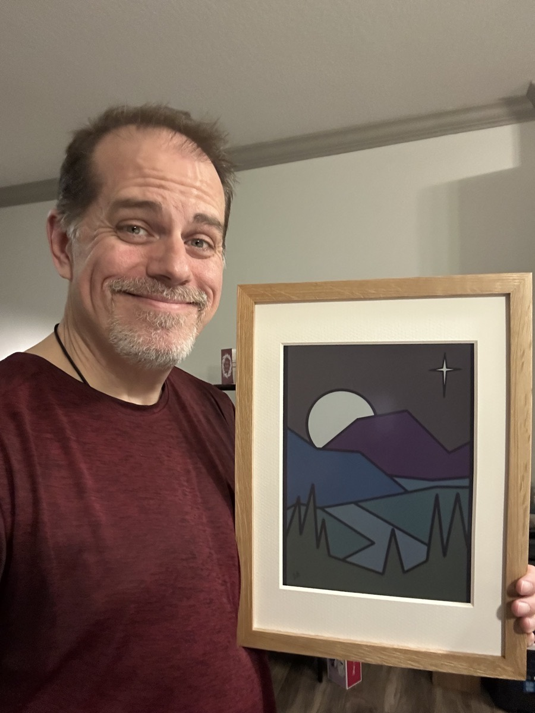

# Rhythms of Grace
### 2026/01/13

Although I haven't posted a blog entry daily this year, I continue to journal. So...YAY! I sat down a few days ago to blog and just didn't feel it. I hoped to post an entry daily this year. But the main goal was to journal daily. And that is still going strong. I'm developing a habit of documenting how I am experience each day. Not all of that would translate to a blog post. There are a lot of written prayers. Some basic notes. A list of scripture references I encounter each day. And some random musings. But there are certainly days when nothing is *worth* posting here. So, there you have it...hehehe

I use an AI agent to help me stay organized with my journal. Even if I handwrite something, I feed it to the agent to further explore things. Or to simply keep the record of my thoughts in one manageable place for further exploration in the future. Today, I tried to have it "Prep my blog" from what I had written throughout the day. What it spit out wasn't good enough to just dump here...LOL Very little of what I wrote today was translatable to this medium...LOL

Something I explored today that I do want to talk about, but didn't handwrite much about today, is something related to my schedule and routine. A few months ago, I had to slightly shift my sleep schedule to accommodate a shift in my work schedule. Instead of a 1-1:30am bedtime, I moved it to midnight. After the new year, I shifted it further to be 11pm. Midnight just wasn't working for my work schedule. Well, 11pm has been killing my spirit...LOL But good news! My work schedule shifted again at the end of last week...LOL Which means I can try shifting my sleep schedule to around 12:30am! Yay!!! Tonight I'm planning to give that a try. We'll see how that goes this week and maybe next week.

What I've been doing with things like this routine and sleep schedule is try to align my spirit with the rhythms of God's Grace with all of this. I do my best to accommodate the world I live in. And that often means I have to do things my body, mind, and spirit don't like. We all do. Some of us do it better than others. I'm sort of in the middle, I think. I've been sleeping for 4 years now. That's great considering decades of not sleeping...LOL But what this has done has shown me the importance of sleep. So needing to sleep while accommodating my world's schedule has been a balancing act since around June, 2024.

When I switched to 11pm, I lost a lot. I'll not go too much into that. But I noticed it. But so far today, I've already gained back what I had lost. One thing I'm truly excited about is an art piece I'm working on for Malachi. I made some huge progress on it tonight. And yet, I'm still finding time to finish my journal and write in my blog. My heart is full and so happy tonight <3

Speaking of artwork, I finished "Creation & God's Nature" on Saturday. It's the piece that is inspired by week 1 of our Bible study with the same title. And today I received my e-ink wall art frame. So this latest work is on display in my home <3 I'll update the frame to display different pieces over time. Most likely the latest in this Bible study collection. I hope to complete 54 digital paintings by the time we complete this study. That's a little ambitious by the sound of it. But the works aren't that complicated...hehehe

I'm not finished with the first piece in the collection because I've decided to recreate it in Clip Studio Paint. I originally started it in Infinite Painter. It looked fine and all. But as I was working on the second piece, "Create & God's Nature", I realized how much better Clip Studio Paint is and wanted to take a fresh look at the first piece in the collection. Since I hadn't actually finished it yet, it made sense to move the idea over. I hope to complete it, and the third piece, this week. The third one is for week 2 of the study...hehehe

Here is "Creation & God's Nature" as the digital painting...

Here it is in the e-ink frame...in my hand...LOL

It has been too cold to do my exercise walks this week. It seems Winter has returned to Florida...LOL I'm not sure how long it will last this time. It isn't super cold. But as I learned during my training in 2023, the moist air in Florida doesn't feel too good in the lungs when it's in the 60s or below when I do an exercise walk or jog. It's like breathing ice. Sort of like when I lived in Indiana and the temps would drop below 20. I don't understand the science behind it, if there is any at all. Mostly because I haven't looked into it. But the *feel* of it all isn't pleasant. People have laughed at me. But when I describe it, they stop laughing...LOL

I may have mentioned I'm reading Bambi? Well, last night...yeah..."Bambi was never to see his mother again." :(

I've fallen in love with reading. I don't read everyday. But I do most days. I'm certain I've mentioned that before. But to say I truly love it is the best way for me to say it. Sure, it took about 46 years to love reading...LOL I'm so glad I do. I'm also glad I switched to using a Kindle last year! That's when things really took off for me. The year before that, I read physical books. But they wore me out...LOL Holding them and trying to follow the page as it moved did a thing to my brain or something. But reading from an e-reader has brought stability to my hands and eyes. Perhaps it has something to do with my tremor? My hands and eyes are constantly moving. So a paper book isn't the best way for me to read...LOL Hmmm...maybe that's why e-ink screens seem to be better for my brain in general...hmmm

I'm super close to being finished with my latest poem. I was technically done with it last night. But I pondered an extension to my original plan. I planned out 3 sections with 2 stanzas each. But then I worked out a forth section as sort of an invitation to the reader. I'll work that out and see how it goes. I don't imagine there will be anything more after that. I thought about doing a fifth section because I liked the idea of an odd number of sections...LOL But that might be a bit much with this one...LOL

I also had an idea for my latest short story. It isn't finished yet either. But it has inspired an idea for a book...hehehe I'll finish the short story first. But I may plan out a book as an extension of that story. It could be fun!

My creative juices seem to be aligning with the rhythm of Grace I mentioned earlier. That's another reason I want to work out my sleep schedule and routine. When I moved my schedule a few months ago, my creative juices weren't flowing like they are at the moment. I'm going to enjoy this for as long as I can. It's exciting and giving me a boost!