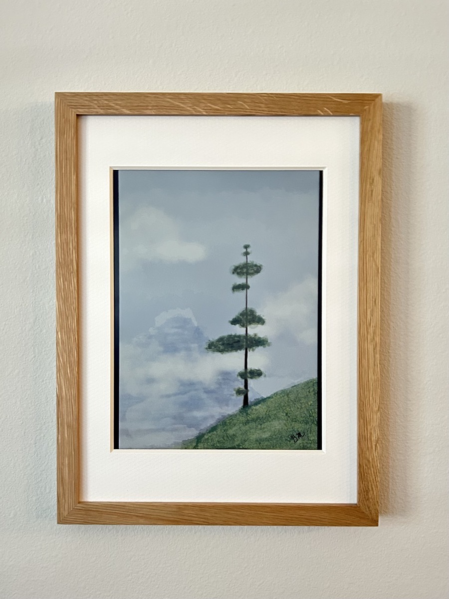
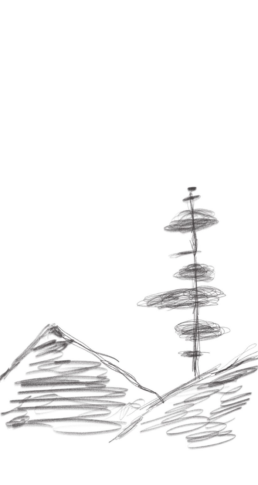

# Frozen Florida
### 2026/01/31

## 7:50a

I'm going to try a timestamp entry today. I miss doing these... hehehe I've had a great week at work and personally. It was productive and I took some moments to rest when I needed. After the week of headaches, including that migraine day, I'm grateful this week went well. I finished this weeks piece, "Prayer", last night. I tried some old and new things with this one. I love how it turned out. I wanted to go to Disney today. But the forecast turned me off to the idea. Then I thought how much fun I could have taking my newest Olaf on a Frozen adventure. So I may spend a little time there this weekend... or maybe not... LOL

## 8:30a

I just realized I have been journaling everyday this year. I haven't blogged each day. But I have a journal for each. I have a goal to do that this year. So far so good... hehehe I have designed an AI assistant for my journal process. Some days it has been helpful. Other days there is a bit of friction when we don't seem to understand one another... LOL AI really is becoming like people... LOL j/k It's a useful tool. But it doesn't yet have feelings or true thoughts yet. Perhaps the AI will someday go from *artificial* to *actual*. For now, I still need my actual intelligence to use it properly... LOL

## 10:25a

I'm considering moving my blog again. I'd like to keep this *By Greg Marine* site dedicated to my creative side. But I could move the blog to my, now ancient, *Greg Marine* domain. I haven't used it in years. I've kept it to retain ownership. These are just thoughts for now. I'm going to work on a new painting next. This one is for Malachi ♡

## 12:30p

"Malachi's" painting is going quite well. It's based on a sketch I made last month at Tracy and Bryan's house. They had a Christmas ornament of a tree on a hill with a mountain in the background that caught my eye. So I sketched it with the intent to eventually make a painting. I've decided to gift that to Malachi ♡

Trexina decided to color match Trex today... hehehe

## 1:05p

The "Rex's" reminded me of my abundant life. God has given me so much. When I finally let go of what I've lost, I could finally see what I have. God has given me an abundant life in my everyday moments. I am truly Blessed.

I'm enjoying chili on this chilly day... hehehe

## 2:00p

I have finished "Messenger of God" ♡

A scripture to accompany this work comes from Isaiah 55:10-11

> "For just as the rain and snow fall from heaven and do not return without watering the earth, making it bud and sprout, and providing seed to the sower and food to the eater, so My word that proceeds from My mouth will not return to Me empty, but it will accomplish what I please, and it will prosper where I send it."

I'm grateful to experience and witness God's goodness through this painting. I did not expect to do this today. I further did not expect to finish it so quickly ♡

## 2:55p

Here is the sketch the painting is based on...

It's so neat to see how these things come together. I did the original sketch on my Palma 2 Pro "in the moment." I used this as a reference for a sketch I then made on my art tablet this morning... hehehe Now, there is a finished work ♡

## 5:30p

I spent much of the rest of the afternoon playing around with a DIY e-ink frame. I got it a while ago and hadn't gotten around to checking it out. It isn't a plug-n-play thing. There were basically 3 different versions for me to choose from in this DIY space. I picked this particular one because someone on Reddit had created a convenient example for me to start from. I finally got around to trying it. I'm looking forward to exploring this more.

I just got back from the grocery. Time for dinner... hehehe

## 6:15p

This has been one of those days when I can't stop thinking about how grateful I am.

Church was canceled for tomorrow again this week due to weather. Two weeks in a row, winter storms are hitting. And this one is having a direct impact all the way down here in Florida.

Bible study time! I'm going to wrap up this amazing week of studying prayer ♡

## 8:00p

All finished with this week's Bible study. This was such an insightful journey this week. All 4 lessons have been. What this book is inspiring is so amazing. I'm excited to continue the journey in the coming week ♡

## 9:30p

I did not go to Disney today... LOL And I don't plan to go tomorrow.

I'm glad I did my grocery trip today. I'm feeling this weather change...

I did 8 loads of laundry... LOL Along with everything else I did today. It has been a great day ♡

## 11:00p

The "feels like" temp is at 14 right now. And it's still dropping. This is the coldest I've experience since moving here. Florida...is Frozen...hehehe