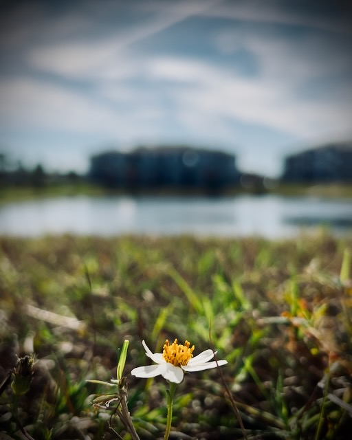
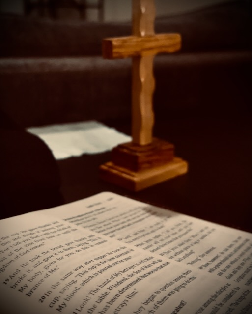
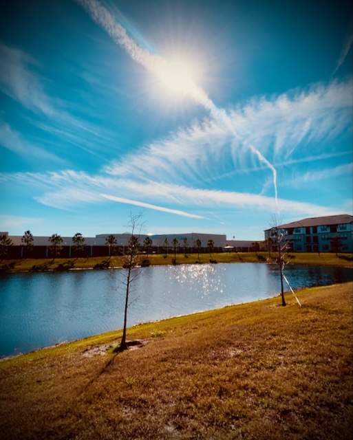
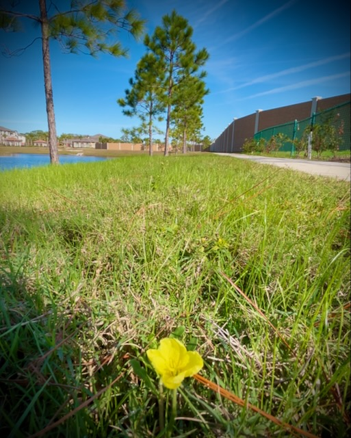
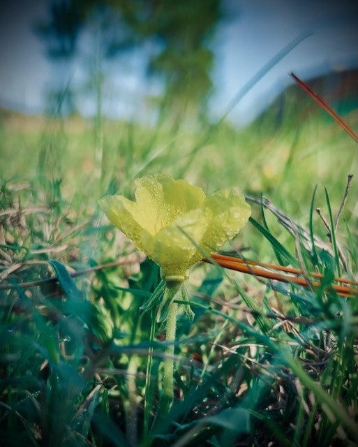
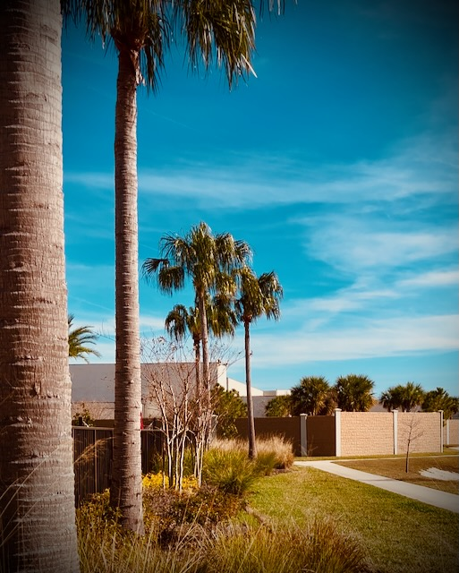
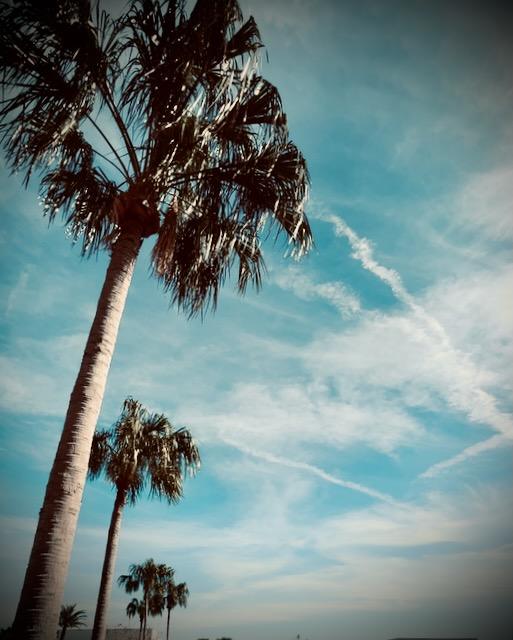

# Happy New Year!

2025 has arrived! Yay!! I'm so excited!!!

I recorded [this video journal](https://youtu.be/30Dhlq3Lwqw) for today. I don't know how often I'll do that this year. But I do want to do these as often as I feel inspired. Today felt like a good day to do one...hehehe

In the video, I mentioned I walked a mile for my first walk. I did 2 other 1 mile walks throughout the day. It was a great day to be outside for my walks. Like the other day, it was leisurely and not at an exercise pace. I do hope to do exercising again this year. I may bring jogging back. It isn't a specific goal or resolution, though.

Although I did watch a few movies last night, I was productive as well. I wrote yesterday's journal entry and updated this site with the latest code behind the magic here. Late last year, I contemplated how I would do the journal in the new year and where I'd host it. I decided to keep with what I was already doing. I thought the system was being bogged down by the ever increasing number of files I add for entries. Turns out I was wrong. It still only takes about a minute to process the entire site and deploy it to my web server...LOL So, I'll keep it going on the same system without needing to archive past entries.

The last movie I watched for 2024 was *Big*. The first movie I watched for 2025 was *Fantasia*. I hadn't really planned on watching movies last night. But It was nice having them on as I did other things. I also had two dinners last night. I made soy-less tofu tacos for my usual dinner. And then I had a veggie burger and some broccoli for my second dinner just before the first new year's celebration. I rang in the new year in both the eastern and pacific timezones once again. And started off the year with communion and prayer after each celebration. Overall, I had a very pleasant evening.

Today was pleasant as well. I've managed to touch most of the items on my goals and resolutions list. I wanted to do at least a little something with most of it on this first day to get off to a good start. I have 3 categories on my list. Resolutions, Goals, and Monthly tasks. One of the resolutions also crosses over to the monthly category. This isn't a formal thing really. Just a way for me to view it all. The resolutions are absolutes. I intend to accomplish those to the best of my ability through God's strength. The goals are just some nice things to have accomplished if I can. And the monthly things are just some stuff I'd like to do each month. As-in, January has its thing, February will have its thing...and so on. January's is the annual prayer and fasting that I've done the previous 2 years.

I started a *Bible in a Year* plan today that is called *The Bible Recap*. It is very similar to the one I did last year except it also includes some videos that highlight some things about what was read that day. So, it is more of a deeper dive than just reading it. Something I'm considering also doing with this is journaling daily about what I've read. I didn't do that today. I may do some catch up on that this weekend. I need to set up my journaling flow. Saturday will be a good day for that. I didn't start it early enough today to work it out today. Since I work the next 2 days, I'll likely not have enough time to work it out either. So, Saturday is when I'd like to work out my journaling workflow for the Bible in a Year.

One of my things in the Goals category for this year is to do a daily photo and post it on Instagram, Threads, and Facebook. The latter 2 because it's easy to cross post from Instagram...hehehe I've called it *Year Through My Lens*. I've decided to make it a goal instead of a resolution. It is art and a form of expression. It may or may not impact my life in some profound way. I view resolutions as being something that will make a considerable impact on my life. But the photos will be fun. If I do indeed to it daily, I'll have 365 photos for the year. There'll be many more than that. I capture a lot each day. But for this, I'll pick my favorite.

I'll include the honorable mentions at the end of this entry...hehehe

I took down my Christmas tree and put it back into storage. I also cleared one of my desks and consolidated those workspaces into another desk. I still have 2 other desks to clear up. I have 4 desk total...LOL My aim is to get it down to 1. I may still keep 1 other desk around if I get my 3D printer back up and running. That work needs it's own desk. But everything else I do can be done from a single desk. I have ideas for simplifying that even more. But that'll be a task for another month. For this month, my goal is to simplify down to a single desk...hehehe Making some effort toward that today felt good.

I didn't get around to doing any creative writing today. I had hoped to. I thought about doing some of that last night too. But didn't get to it last night either. My thinker is just tired...hehehe December was a really full month for me...in a good way. I think I'll be able to get some creative work done tomorrow night, though. I have some things cooking in my brain that I'm ready to get out.

What will happen in 2025? I don't know what to expect. And I will refrain from having any expectations beyond knowing that God is good and his loving kindness endures forever. I'll work on my resolutions everyday and my goals on the days that are applicable. I'm going to keep moving forward on this journey and will remain alert to what God is doing. Happy New Year!

As promised, the honorable mentions...hehehe

