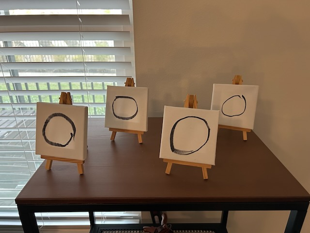
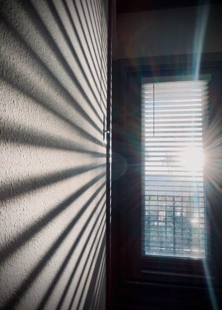

# Circle of Life

*This year was supposed to be great. It's only the second day and I'm a loser...* ~ Ross Geller (FRIENDS S5.E11, *The One with All the Resolutions*)

I'm on day two of no coffee...I'm not doing so well...LOL j/k I knew it would be hard. But listen, I've gone a few days without coffee before. Why is it so hard *this time*?!? LOL I got 7 and half great hours of sleep last night. Yet, I've been dragging all day long...LOL I haven't felt this tired in years. But every time I have something to eat, I suddenly feel energetic and wide awake. I think this might mean it is more than just about not having coffee for a few days...LOL But I would really love a cup of coffee...or two...LOL

I've decided I'm not doing the prayer and fasting plan that I intended to start next week. I don't feel like I need to go through the same plan I have done for the last few years. I can still connect with God in new ways. He's always doing new things in my life. Why not embrace that and change it up this year? The plan I was going to do was the same one theChapel will be doing. I'll do something different. I won't be attending that church anymore anyway.

I have replaced my mini paintings on the one shelf with a series of ensō paintings I did in late 2021. I feel they best represent how I feel going into this new year. God painted my life in a single stroke from beginning to end. I came from him and I'm going back to him. That's my *circle of life*...hehehe I placed 4 of them on the shelf. There's no significance to that number. It just happens to be the number of them I pulled out of my art tote...LOL

These are crude and look nothing like a traditional Japanese Ensō painting. It was still quite difficult for me to paint back then due to my tremor. I was lucky to get anything that resembled a circular motion in a single stroke at the time. When I did all of my other paintings, each stroke was minimal. Everything took time and multiple strokes to produce anything. A single circular motion was incredibly difficult. It's good to be able to look back and see how far I've come and have been able to accomplish. I should try to do a more traditional Japanese Ensō this year now that my tremors aren't so bad...LOL

I'm grateful I've had things to look back on these past few years since the second half of 2021. These are the years of healing. Everything before that is mostly a blur and I have very little to look back on from the period before 2021. That's okay. Just because it's hard to look back and remember things from before doesn't mean it's impossible. It just means I need to give it a little more effort.

Each year since 2021, I've added a little more to my life in a way of staying connected with life. I think the most significant so far as been this journal. I think the next leap is my videos and photos. That evolved slowly last year and took a leap toward the end of the year. I'm carrying that momentum into this year. It will be great to have so much to look back on.

Here is today's photo:

I really love how this one turned out. I don't love the *Year Through My Lens* title I gave this *project* yesterday. I don't really know why I gave it a title at all. I hadn't planned on it. I suppose I just wanted to put something in the post. I left off the title today...LOL

I watched *The Lion King II: Simba's Pride* tonight. It was silly but fun. Kind of like *Bambi II* was. I had heard of the movie long ago. But watching *Mufasa: The Lion King* last weekend got me thinking about how I had only ever seen the original and the live-action remake for watching Mufasa. I hadn't seen any of the other animated films. Time to catch up!

Walt Disney passed away in 1966. Buzz Aldrin and Neil Armstrong landed on the moon in 1969. Imagine what the world would be like today had Walt Disney been alive to see people walking on the moon! Disney's imagination was beautiful. I wasn't around yet when he passed. But I feel like I miss him. I didn't know the man. I only know the stories about the man. I wonder what he was really like...hehehe

Where will I travel and what will I do this year? Having no expectations leaves me to daydream about an amazing year ahead. One that I'm very much looking forward to <3