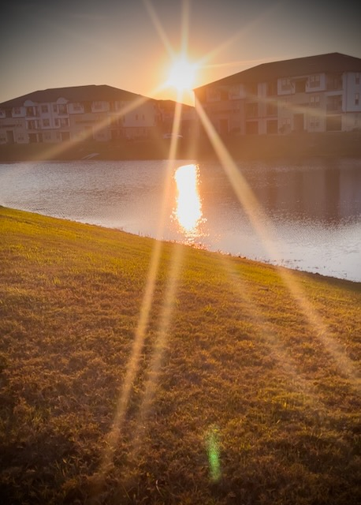

# God Revealed in the Journey

## 21 Days of Prayer and Fasting

As I began to pray this morning, I meditated on what these seasons of prayer and fasting have meant and done since I began this two years ago. In 2023, the first one, it led me to taking care of my heart, soul, mind, and strength. It became a spiritual act of worship to face my past and to begin taking care of the body God gave me. As my heart, soul, mind, and strength were being restored, it gave me a new capacity to love God with all my heart, soul, mind, and strength. It was amazing!

In 2024, last year and the the second season, my heart was transformed as I began just a few months earlier to seek first His Kingdom and Righteousness every day. This led me to doing Bible devotionals and eventually the current Bible study I'm doing in fellowship. In this process, it has helped me learn how to love what God created in me and then how to love others as I love myself. It was amazing as well!

As I wait and hope in the Lord for this year's season of prayer and fasting, I am excited as I look back and realize He has been showing me how to live out the greatest commandments. How cool is that?!? So far this time, I get a sense that He is showing me how to be dependent solely and wholly on Him. He is my provider and the provider for everyone and everything. He created it all and all of us. Everything comes from Him and actually belongs to Him. By seeking Him and His Kingdom first, everything else will work out.

Through this process, I come to today's prayer focus. God is revealing Himself to those He has chosen. I am one He is revealing Himself to. As I continue to ask Him to show me more of Himself so that I can know Him more, He has been pouring out into my daily prayers and time in the Word new things everyday. I suppose this is one of the reasons I had a desire to continuing doing a *Bible in a Year* plan this year. And to continue doing a season of praying and fasting to begin the year even though I'm no longer attending the church where I began this practice. He is revealing Himself to me and establishing that this is a relationship between He and I. A two way spiritual relationship.

*Father God in Heaven, I thank you today! You are the creator of all things. You know all things and are in control of it all. And You have chosen to reveal Yourself to me in new ways each day. I praise You for revealing Yourself to me yesterday, today, and forever. Thank You so much for helping me know You more. You did not have to do this. Yet, You did it anyway! THANK YOU!*

*As I wait on and hope in You for the church community You want me to be a part of, I further thank and praise You for revealing Yourself and Your perfect Will to the imperfect church I'm going to be going to someday. Please remind us daily of who You are and that You are our Provider. Help us to know what it means to take up Your yoke as You help carry the burdens of the church.*

*I lay at Your feet the pastor of that church and his family. Reveal to him Your Will and help him to love You with all his heart, soul, mind, and strength. Help him to love others as he loves himself. Guide and direct Him on the path You have chosen for him. Please bless his family everyday.*

*I thank you, Lord, for allowing me to come to You today in prayer. It is with thanksgiving and gratitude in my heart, and in Your Name, I pray. AMEN!*

Today's reading was John 3. Here we see the conversation between Jesus and Nicodemus. I am reminded today that I prefer to expand the passage from the typical *John 3:16* verse. I love to include verses 14-17. It expresses that it is a relationship. It isn't just one way. I have my role in the relationship. He has His. Mine is to look to Him, follow Him, listen to Him, and love Him. He already loved us so much that He gave His only son. And He did not send His son to to condemn the world. The act was to save it.

It goes on to talk about a conversation between John the Baptizer and his disciples where they questioned him about what Jesus was doing. John reveals that his purpose was now complete and that Jesus must now increase and he (John) must decrease. It's the *more of Him and less of me* concept I am hoping to fulfill in my own life each day.

## My Health Journey

I was thinking about how my health journey began 2 years ago during that year's prayer and fast season. I recall, at the time, I simply wanted to stop feeling so awful all the time. Just walking to my car was a chore. Trying to keep up with family and friends when I would visit was almost no longer worth seeing them...in that I felt like I was dying. I'm not exaggerating!

In my prayers that season, I felt a sudden desire to begin walking around the pond here at home. It was a *get up and walk* moment. I knew it wasn't going to be easy. But I felt as though it might do some good. This, of course, led to a journey that has had amazing results. But it is a case of a good thing happening from something that began with the *wrong* motivation.

At the same time, I was also making a decision to face my past. If I was going to begin repairing my physical wellbeing, I knew my mental and spiritual wellbeing needed some work as well. And in that process, my motivations changed. I went from simply wanting to feel good to making it a spiritual act of worship. It became taking care of *this* temple of the Holy Spirit.

Of course, there isn't anything actually wrong with wanting to feel better...hehehe That's why I emphasized the word a few paragraphs ago. But when I changed my motivations from doing this for myself to doing it as a form of worship, everything about it changed.

That same thing happened when I changed my motivations for training for the race I ran at the end of 2023. When I first started training, my motivation was to overcome the negative things people used to tell me about myself. Those who made me feel worthless and like a failure. And those who abused me. I would *hear* their voices and I'd work hard to run faster than their voices would carry.

Then, one day, I started to *hear* my supports cheering for me instead. I began running toward those cheers instead of running away from the jeers. Whoa! What a difference that made! I suddenly leaped forward in my progress!

The point I'm making is this...yes, any motivation can get you started. Getting started is always a good thing. But with the *right* motivation, even more amazing things can happen. Taking the focus off of myself and putting onto God healed my heart, soul, mind, and body. Taking the focus off the naysayers and focusing on the *yay*sayers helped me excel the progress. Light truly does overcome darkness. My story is a testament to that!

## Photo of the Day

I had 8 photos to choose from today. A few I was able to eliminate rather quickly. But there were a pair that I really wanted to make the cut...LOL What I ended up doing was choosing the one I felt best fit for today and then I posted the video that the other one came from on my IG and FB stories...hehehe So, in a way, I did post both...LOL The runner up will just expire tomorrow night...LOL Here is the one I chose as the photo for today:

It is very similar to yesterday's in that it features the sun. Yesterday, I posted one of the *sunrise*. Today's is a *sunset*. Today's is actually unfiltered digitally. What I did was place my sunglasses over the camera lens. It created the starburst effect. And since the angle I chose caught the reflection off the pond, it has a double effect. I love the composition of the photo, the technique to capture it, and the fact that I didn't use any digital filters to make it appear the way I saw it in the moment.

## Wrapping Up

I don't have a lot to say about the day, really. I made some progress with work. All of my meals were delicious. I enjoyed my 3 prayer walks. My morning devotional was inspiring. The *Bible in a Year* reading was also inspiring. Today's Bible study session was amazing. Overall, a terrific day <3

So far so good with all of my New Year's Resolutions...hehehe As far as the informal goals, there are a few I haven't tackled yet. But most of them are already daily. I'm pretty happy that, after a week, I'm doing well with my resolutions and goals. I'm actually a bit surprised at my progress. Yes, I know it's early in the year. But I have hope...hehehe

Today's prayer focus was about God revealing Himself. There were a few areas of note in regard to Him revealing who He is today. The first was in creation. On one of my walks today, I observed the birds in the area and the clouds in the sky. I marveled at how He created all of it. I could see His fingerprints all over the sky. The second was through a text a received from a friend who was asking for prayer for a few people. He reveals Himself through the fellowship of agreement in prayer. To be asked to intercede through prayer is a gift I cherish. Both of these things brought me closer to God today <3